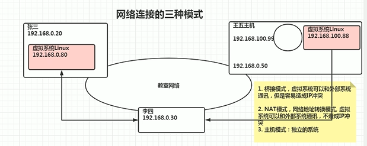

# Liunx

## 1.网络连接三种方式

1.桥接模式，虚拟系统可以和外部系统通讯，但是容易造成IP冲突

2.NAT模式，网络地址转换模式。虚拟系统可以和外部系统通讯，不造成IP冲突

3.主机模式:独立的系统 （不与外界网络连接，想怎么配，怎么配）



## 2.虚拟机克隆

> 迁移虚拟机

方式一：直接找到你安装的虚拟机，复制这个目录到新的环境，再通过vm打开即可（easy）

方式二：vm克隆，需要先关闭Linux系统。（右击你克隆的虚拟机---》管理---->克隆，根据步骤完成（采用完全克隆的方式，不采用引用的方式））

## 3.虚拟机快照

> 将系统回到初始状态或你保存的状态

右击你的虚拟机---》快照---》拍摄快照（快照管理可以查看你每次的快照）

## 4.虚拟机的迁移

> 迁移和克隆是一样的（找对安装目录即可）

## 5.vmtools的安装

**在linux中安装**

> 安装vmtools的步骤
>
> 1.进入centos点击vm菜单的->install vmware toolscentos
>
> 2.会出现一个vm的安装包，xx.tar.gz
>
> 3.拷贝到 /opt
>
> 4.使用解压命令 tar, 得到一个安装文件
>
> 5.进入该vm解压的目录，/opt 目录下
>
> 6.安装./vmware-install.pl
>
> 7.全部使用默认设置即可，就可以安装成功
>
> 注意:安装vmtools需要有gcc.

**在vm中设置**

> 基本介绍
>
> ​	为了方便，可以设置一个共享文件夹，比如d:/myshare
>
> 具体步骤
> 	1.工菜单->vm->setting,如图设置即可注意:设置选项为always enable这样可以读写了
>
> ​	2.windows和centos可共享 d:/myshare目录可以读写文件了
>
> ​	3.共享文件夹在centos的/mnt/hgfs/下
>
> **注意事项和细节说明**
>
> ​	windows 和 contos 就可以共享文件了，但是在实际开发中，文件的上传下载是需要使用 远程方式完成的
>
> 远程方式登录，借助第三方工具xfrp等

## 6.**Linux目录结构

/bin

/sbin

/home

/root

/lib

/lost/found

/etc

/usr

/boot

/proc   **不能动**

/srv  **不能动**

/sys  **不能动**

/tmp

/dev   所有的硬件都在这个文件下 （例如：硬盘）

/media

/mnt

/opt

/usr/local

/var

/selinux

## 7.Linux远程登录和文件传输

使用xshell xftp

## 8.vi vim的使用


## 9.linux关机重启

- shutdown -h now  立刻关机
- shutdown -h 1  1分钟后关机  和shutdown一样
- shutdown -r now  现在重新启动计算机
- halt  关机，作用和shutdown -h now  立刻关一样
- reboot  现在重新启动计算机
- sync **把内存的数据同步到磁盘**

**注意细节**

- ​	不管是重启系统还是关闭系统，首先要运行svnc命令，把内存中的数据写到磁盘中
- ​	目前的 shutdown/reboot/halt 等命令均已经在关机前进行了 sync ，老韩提醒: 小心驶得万年船

## 10.登录注销


> logout：注销---->在运行级别3中有效，也就是无界面

> su - root 切换到root下  ，logout则回到登录用户，再logout则退出

## 11.用户管理

### 用户

1.添加用户

> useradd  用户名      解释：添加用户
>
> useradd -d 目录  用户名   例如：useradd -d /home/test king  表示test为king用户管理的目录
>
> useradd -g 用户组 用户名   解释：增加用户时直接加上组

2.修改用户密码或设置密码

> passwd 用户名  给这个用户名设置密码或修改密码

3.删除用户

>userdel 用户名
>
>应用案例：
>
>1.删除用户，保留用户目录 -----》userdel 用户名
>
>2.删除用户和用户目录------》userdel -r 用户名 **慎重**

4.查询用户

> id 用户名

5.切换用户

> su - 用户名
>
> 注：权限高的向权限低的，不需要密码
>
> ​		回到原来用户-》》logout或exit

6.查看当前第一次登录的用户（su - 换用户后  查看的还是第一登录的用户）

> whoami  或  who am i

### 用户组

1.新增用户组

> groupadd 组名

2.删除组

> groupdel 组名

3.增加用户时直接加上组

> useradd -g 用户组 用户名

4.修改用户的组  用root用户修改组

> usermod -g 用户组 用户名
>
> usermod -d 目录名 用户名  改变改用户登录的初始目录 。 **注意：**用户需要有进入到新目录的权限

### 用户和组相关文件

/etc/passwd 文件

- 用户(user)的配置文件，记录用户的各种信息
- 每行的含义:用户名:口令(一般这里是x ，加密):用户标识号:组标识号:注释性描述:主目录:登录Shell

/etc/shadow 文件

- 口令的配置文件

- 每行的含义:登录名:加密口令(密码：加密的，！是没有密码):最后一次修改时间:最小时间间隔:最大时间间隔:警告时间:不活动时间:失效时间:标志

/etc/group 文件

- 组(group)的配置文件，记录Linux包含的组的信息
- 每行含义:组名:口令:组标识号:组内用户列表

## 12.指定运行级别

> 基本介绍运行级别说明:
> 0:关机
>
> 1:单用户 (找回丢失密码)
>
> 2:多用户状态没有网络服务  (无意义)
>
> 3.多用户状态有网络服务
>
> 4:系统未使用保留给用户 （现在无意义）
>
> 5:图形界面
>
> 6:系统重启
>
> 注意：常用运行级别是3和5，也可以指定默认运行级别（可以设置），后面演示
>
> **应用实例**
>
> 命令:init [0123456]
>
> ​    应用案例:通过init 来切换不同的运行级别，比如动 5-3 ，然后关机

### 指定默认运行级别

> 在centos7以前，/etc/inittab文件中修改
>
> centos7以后，进行了简化，如下命令
>
> - multi-user.target:类似于运行级别3
> - graphical.target:类似于运行级别5

1.查看当前默认运行级别

> systemctl get-default

2.修改默认运行级别  (例子：运行级别5)

systemctl set-default graphical.target

## 13.找回root密码

> 注意：（不同版本，不太一样，这里是centos7.6以后   这次演示的是7.6）

1.首先，启动系统，进入开机界面，在界面中按“e”进入编辑界面，如图


2.进入编辑界面，使用键盘上的上下键把光标往下移动，找到以““Linux16”开头内容所在的行数”,在行的最后面输入:init=/bin/sh。
如图


3.接者，输入完成后，直接按快捷键:Ctrl+x 进入单用户模式，
4.接着，在光标闪烁的位置中输入:`mount -o remount,rw / ` (注意:各个单词间有空格)，完成后按键盘的回车键(Entcr)。如图


5.在新的一行最后面输入:passwd， 完成后按键盘的回车键(Ener)。输入密码，然后再次确认密码即可(提示:密码长度最好8位以上,但不是必须的)，密码修改成功后，会显示passwd…的样式，说明密码修改成功


7.接着，在鼠标闪烁的位置中(最后一行中)输入:`touch /.autorelabel`(注意:touch与/后面有一个空格)，完成后按键盘的回车键(Enter)


8.继续在光标闪烁的位置中，输入:`exec /sbin/init`(注意:exec与/后面有一个空格)，完成后按键盘的回车键(Enter)，等待系统自动修改密码( 提示:这个过程时间可能有点长，耐心等待)，完成后，系统会自动重启，新的密码生效了

【可选】最后进入后，可再根据`passwd root `改你想改的密码

## 14.帮助命令

man 获得帮助信息

- 基本语法:man 命令或配置文件(功能描述:获得帮助信息)
- 案例:查看Is命令的帮助信息  `man ls`  (空格翻页)

help指令

- 基本语法:help 命令(功能描述:获得shell内置命令的帮助信息)

应用实例

- 案例:查看cd命令的帮助信息  `help cd`

百度帮助更直接
如果英语不太好的，也可以直接百度靠谱

## 15.文件目录类

> pwd：显示绝对路径

> ls
>
> ​	-l :列表显示
>
> ​	-a ：全部显示
>
> ​	-h:   展示信息更容易理解
>
> ​	-R：递归展示

> cd
>
> ​	~ :回到用户目录
>
> ​	.. :回到上级目录

> mkdir
>
> ​	-p：创建多级目录

>rmdir :只能删除空目录
>
>rm -rf   ：递归强制删除，危险

> touch  :创建文件，会修改文件时间

> cp   :拷贝指令
>
> ​	cp [选项] 源 目标
>
> ​		-r :递归拷贝
>
> ​		\cp :强制覆盖代替cp命令

> rm  :删除文件
>
> ​	-r  递归删除目录
>
> ​	-f  不提示强制删除

> mv 重命名和移动文件
>
> ​	mv 源文件  目标

> cat  ：查看文件内容
>
> ​	-n :显示行号
>
> ​	经常用法  cat -n xxx | more   :cat配合管道 查询结果用more交换   回车下行   空格翻页

> more more指令是一个基于V编辑器的文本过滤器，它以全屏幕的方式按页显示文本文件的内容。more
> 指令中内置了若干快捷键(交互的指令)，详见操作说明
>
> 

> less ::查大文件，效率好
>
> less指令用来分屏查看文件内容，它的功能与more指令类似，但是比more指令更加强大，支持各种显示终端。less指令在显示文件内容时，并不是一次将整个文件加载之后才显示，而是根据显示需要加载内容，对于显示大型文件具有较高的效率
>
> 

> echo ：输出内容到控制台
>
> ​	例如：输出环境变量：echo $HOSTNAME

> head :head用于显示文件的开头部分内容，默认情况下head指令显示文件的前10行内容
>
> ​	-n 5  :显示前5行

> tail  :tail用于输出文件中尾部的内容，默认情况下tail指令显示文件的前10行内容。
>
> ​	-n
>
> ​	-f :实时的追踪文档的更新

> 理解：能显示的都能写道文件中
>
> ·>·    输出重定向   例如：echo "hello" >  a.txt  （会覆盖）
>
> ·>>·  追加   例如：echo "hello" >>  a.txt   （追加） 
>
> 

> ln :软链接也称为符号链接，类似于windows里的快捷方式，主要存放了链接其他文件的路径
>
> 语法：ln -s 原文件或目录 软链接名    ：给原文件创建一个软链接  类似于win的快捷方式
>
> 应用案例  ln -s /root /home/myroot   
>
> rm /home/myroot   :删除软连接

> history   ：查看历史使用命令
>
> ​	history 10  :表示查看最近使用的10条命令
>
> !编号     ：这个编号是用history查看的那个命令前的编号   意思是把这个命令重新执行一遍，或者直接重新打一遍

## 16.时间日期指令

> date   显示当前日期
>
> 
>
> ​	-s  字符串时间    ：设置系统当前时间  例如：date -s "2024-09-04 14:02:55"

> cal   查看当前月份的日历
>
> cal 2024   :展示2024的1-12的日历

## 17.查找指令

> find    find指令将从指定目录向下递归地遍历其各个子目录，将满足条件的文件或者目录显示在终端。
>
> 语法：find 搜索范围  选项
>
> 
>
> 例如：
>
> ​	find /home -name hello.txt
>
> ​	find /opt  -user nobody   :查找/opt目录下，用户名为nobody的文件
>
> ​	find / -size +200M    查找整个linux大于200M的文件  （+大于 -小于 不写则是等于  ，单位有k,M,G）

> locate  :locate指令可以快速定位文件路径。locate指令利用事先建立的系统中所有文件名称及路径的locate数据库实现快速定位给定的文件。Locate指令无需遍历整个文件系统，查询速度较快。为了保证查询结果的准确度，**管理员必须定期更新locate时刻**
>
> 基本语法
> locate 搜索文件
> 特别说明
> 由于locate指令基于数据库进行查询，所以**第一次运行前，必须使用`updatedb`指令创建locate数据库**,

> which   ：可以查看某个指令在那个目录下  例如ls  which ls

> grep 和管道符号  |
>
> ​	grep 过滤查找     语法：grep  选项  查找内容  源文件  
>
> ​		-n  显示行号
>
> ​		-i  忽略大小写
>
> ​	管道符 |  表示将前一个命令的处理结果输出传递给后面的命令处理
>
> 解释图：
>
> 
>
> cat  a.txt | grep  -n "yes"
>
> grep -n "yes"  a.text

## 18.压缩和解压

> gzip/gunzip   :压缩文件
>
> 

> zip/unzip   :zip 用于压缩文件/文件夹，unzip 用于解压文件/文件夹，这个在项目打包发布中很有用的
>
> 语法：
>
> ​	zip 选项 xxx.zip  压缩的内容
>
> ​		-r 递归压缩，即压缩目录
>
> ​	unzip 选项 xxx.zip  
>
> ​		-d<目录> 指定解压后文件的存放目录
>
> 案例：
>
> ​	zip -r xxx.zip  /home/
>
> ​	unzip -d /opt/ /home/xxx.zip			
>
> 讲解图如下：
>
> ​	 

>tar  打包和解压看选项的选择
>
>语法：
>
>​	tar 选项  xx.tar.gz  打包内容
>
>​	选项
>
>​		-c 产生打包文件
>
>​		-v 显示详细信息
>
>​		-f	指定压缩后的文件
>
>​		-z	打包同时压缩
>
>​		-x	解包.tar文件
>
>
>
>案例：
>
>tar -zxvf   xxx.tar.gz  -C /opt  解压缩到/opt
>
>tar -zcvf	pc.tar.gz  /home/xxx/a.txt  /home/xxx/b.txt   打包

------

## 19.linux组（难点）

> 一个文件/目录有 所有者 所在组 其他组 ；
>
> ​	所有者：某个用户对这个文件的权限，一般是谁创建谁是创建者
>
> ​	所在组：是某个组对这个文件的权限，默认是创建者所在的组
>
> ​	其他组：其余的组对这个文件的权限


### 1.所有者

> 查看文件的所有者
>
> ​	ls -ahl

> 修改文件所有者
>
> chown 用户名 文件名

### 2.所在组

> 修改文件所在组
>
> chgrp 组名 文件名

### 3.其他租

> 除文件的所有者和所在组的用户外，系统的其它用户都是文件的其它组

### 4.改变用户所在组

> 在添加用户时，可以指定将该用户添加到哪个组中，同样的用root的管理权限可以改变某个用户所在的组。
>
> - 改变用户所在组
>   - `usermod -g 新组名 用户名`
>   - `usermod -d 目录名 用户名`  改变该用户登陆的初始目录。特别说明:用户需要有进入到新目录的权限
> - 应用实例
>   - 题目：将 zwj 这个用户从原来所在组，修改到 wudang 组。
>     - 操作：`usermod -g wudang zwj`

## 20.rwx权限

> 权限配合 组 来使用

### 1.基础分析

> `ls -l `查看文件权限
>
> - -rwxrw-r-- 1 root root 1213 Feb 2 09:39 abc
>
> - 0-9位说明
>
>   1.第0位确定文件类型(d，-，l，c，b)
>
>   ​	- 是普通文件
>
>   ​	I 是链接，相当于windows的快捷方式
>
>   ​	d 是目录，相当于windows的文件夹
>
>   ​	c 是价门备文件，鼠标，键盘
>
>   ​	b 是块设备，比如硬盘
>
>   2.第1-3位确定所有者(该文件的所有者)拥有该文件的权限。---User
>
>   3.第4-6位确定所属组(同用户组的)拥有该文件的权限，---Group
>
>   4.第7-9位确定其他用户拥有该文件的权限---Other

> **讲解rwx作用并理解**（理解清楚）
>
> rwx作用到文件 （文件的对象是文件内容）
>
> - [r]代表可读(read):可以读取，查看
>
> - [w]代表可写(write): 可以修改，但是不代表可以删除该文件，**删除一个文件的前提条件是对该名件所在的目录有写权限**，才能删除该文件。
> - [x]代表可执行(execute):可以被执行
>
> rwx作用到目录 （目录的对象是文件本身）
>
> - [r]代表可读(read):    **可以读取，ls查看目录内容**，但目录下文件该有的权限还是有的
> - [w ]代表可写(write):  **可以修改,对目录内创建+删除+重命名目录**
> - [x]代表可执行(execute):    **可以进入该目录   cd操作**
>
> 注意：

> **实例讲解**
>
> `ls -l`中显示的内容如下:
> 	-rwxrw-r-- 1 root root 1213 Feb 2 09:39 abc
>
> 1.10个字符确定不同用户能对文件干什么
>
> - 第一个字符代表文件类型: - l d c b
>
> 其余字符每3个一组(rwx)读(r)写(w)执行(x)
>
> - 第一组rwx:文件拥有者的权限是读、写和执行
>
> - 第二组rw-:与文件拥有者同一组的用户的权限是读、写但不能执行
>
> - 第三组r--:不与文件拥有者同组的其他用户的权限是读不能写和执行
>
> 2.可用数字表示为:r=4,w=2,x=1因此rwx=4+2+1=7
>
> 3.其它说明
>
> 1			   文件 : 硬连接数或	目录 : 子目录数+文件数
>
> root		 用户
>
> root		 组
>
> 1213		文件大小(字节)，如果是文件夹，显示 4096字节
>
> Feb 2 09:39	最后修改日期
>
> abc		 文件名

### 2.修改文件/目录权限-chmod

> `chmod`
>
> **第一种方式: + - = 变更权限**
>
> u:所有者 g:所有组 o:其他人 a:所有人(u、g、o的总和)
>
> 1)`chmod u=rwx,g=rx,o=x 文件/目录名`
>
> 2)`chmod o+w 文件/目录名`
>
> 3)`chmod  a-X  文件/目录名`
>
> **第二种方式:通过数字变更权限**
>
> r=4 w=2 x=1
>
> rwx=4+2+1=7
>
> `chmod u=rwx,g=rx,o=x 文件目录名`相当于 `chmod 751 文件目录名`

### 3.修改文件所用者-chown

> chown
>
> ​	`chown newowner 文件/目录 `  	改变所有者
>
> ​	`chown newowner:newgroup 文件/目录`		改变所有者和所在组
>
> 选项
>
> ​	-R 如果是目录 则使其下所有子文件或目录递归生效

### 4.修改文件/目录所在组-chgrp

> chgrp
>
> ​	`chgrp newgroup 文件/目录`  	修改文件/目录所在组
>
> 选项
>
> ​	-R 如果是目录 则使其下所有子文件或目录递归生效
>
> 应用实例
>
> 使用 root用户创建文件 orange.xt,看看当前这个文件属于哪个组，然后将这个文件所在组，修改到 fnuit 组
>
> 1. `groupadd fruit ` 创建组
> 2. `toueh orange.txt` 创建文件
> 3. 看看当前这个文件属于哪个组->root 组
> 4. `chgrp fmit orange.txt` 修改文件所在组

### 案例

> 题目：
>
> police  警察组
>
> bandit  土匪组
>
> jack，jerry 	：  在警察组
> xh，xq    ：在土匪组
>
> ------
>
> 1.创建组
>
> - `groupadd police`     `groupadd bandit`
>
> 2.创建用户，并将用户放在对应组中
>
> - `useradd -g police jack `
> - `useradd -g police jerry `
> - `useradd -g bandit xh`
> - ` useradd -g bandit xq`
>
> 3.jack 创建一个文件，自己可以读r写w，本组人可以读，其它组没人任何权限
>
> - 首先iack登录:
>
>   - `vim jack.txt` 
>
>   - ` chmod 640 jack.txt`
>
> 4.jack修改该文件，让其它组人可以读，本组人可以读写
>
> - `chmod o=r,g=r jack.txt`
>
> 5.xh 投靠 警察，看看是否可以读写
>
> `usermod -g police xh`
>
> 6.测试，看看是否可以读写，xg是否可以，小结论，就是如果要对目录内的文件进行操作，需要要有对该目录的相应权限

## 21.定时任务调度

### 1.crond（重复）

> crontab 进行定时任务的设置
>
> 概述
>
> ​	任务调度:是指系统在某个时间执行的特定的命令或程序。
>
> ​	任务调度分类:
>
> ​		1.系统工作:有些重要的工作必须周而复始地执行。如病毒扫描等
>
> ​		2.个别用户工作:个别用户可能希望执行某些程序，比如对mysql数据库的备份。
>
> 快速入门
>
> - 设置任务调度文件:/etc/crontab
>
> - 设置个人任务调度。执行crontab-e命令
>
> 基本语法
>
> - crontab	[选顶]
>
> 常用选项
>
> - -e	编辑crontab定时任务
>
> - -l	查询crontab任努
>
> - -r	删除当前用户所有的crontab任务
>
> 常用命令
>
> ```shell
> crontab -e  编辑任务
> conrtab -r 	终止任务调度。全部都没了
> crontab -l  列出当前有那些任务调度
> service crond restart 	重启任务调度
> ```
>
> 
>
> 如图解释：
>
> 
>
> 


#### 入门案例

> 1.`crontabe -e`
>
> 2.在文件中输入`*/1 * * * * ls -l /etc/ > /tmp/to.txt`
>
> 解释如下：5个占位符的说明
>
> |    项目     |         含义         |          范围           |
> | :---------: | :------------------: | :---------------------: |
> | 第一个  “*” | 一小时当中的第几分钟 |          0-59           |
> | 第二个  “*” |  一天当中的第几小时  |          0-23           |
> | 第三个  “*” |  一个月当中的第几天  |          1-31           |
> | 第四个  “*” |   一年当中的第几月   |          1-12           |
> | 第五个  “*” |   一周当中的星期几   | 0-7（0和7都代表星期日） |
>
> 

#### 时间规则

| 特殊符号 |                             含义                             |
| :------: | :----------------------------------------------------------: |
|    *     | 代表任何时间，比如第一个 “*” 就代表一小时中每分钟都执行一次的意思。 |
|    ,     | 代表不连续的时间。比如“0 8,12,16 * * * 命令”，就代表在每天的8点0分，12点0分，16点0分都执行一次命令 |
|    -     | 代表连续的时间范围。比如“0 5 * * 1-6命令”，代表在周一到周六的凌晨5点0分执行命令 |
|   */n    | 代表每隔多久执行一次。比如“*/10 * * * * 命令”，代表每隔10分钟就执行一遍命令 |

#### 一些规则

| 时间              | 含义                                                         |
| ----------------- | ------------------------------------------------------------ |
| 45 22 * * * 命令  | 在22点45分执行命令                                           |
| 0 17 * * 1命令    | 每周1 的17点0分执行命令                                      |
| 0 5 1,15 * * 命令 | 每月1号和15号的凌晨5点0分执行命令                            |
| 40 4 * * 1-5 命令 | 每周一到周五的凌晨4点40分执行命令                            |
| */10 4 * * * 命令 | 每天的凌晨4点，每隔10分钟执行一次命令                        |
| 0 0 1,15 * 1 命令 | 每月1号和15号，每周1的0点0分都会执行命令。注意:星期几和几号最好不要同时出现，因为他们定义的都是天。非常容易让管理员混乱。 |
|                   |                                                              |
|                   |                                                              |

### 2.at(一次)

> 1.基本介绍
>
> 1. at命令是一次性定时计划任务，at的守护进程atd会以后台模式运行，检查作业队列来运行。
>
> 2. 默认情况下，atd守护进程每60秒检查作业队列，有作业时，会检查作业运行时间，如果时间与当前时间匹配，则运行此作业。
>
> 3. at命令是一次性定时计划任务，执行完一个任务后不再执行此任务了
>
> 4. 在使用at命令的时候，**一定要保证证atd进程的启动**，可以使用相关指令来查看
>    - `ps -ef | grep atd`
>
> 2.at命令格式
>
> ​	at [选项]  [时间]            ## **Ctrl +D 结束at命令 ---》输入2次**
>
>  [选项] 
>
> |     选项      |                           含义                           |
> | :-----------: | :------------------------------------------------------: |
> |      -m       | 当指定的任务被完成后，将给用户发送邮件，即使没有标准输出 |
> |      -I       |                        atq的别名                         |
> |      -d       |                        atrm的别名                        |
> |      -v       |                  显示任务将被执行的时间                  |
> |      -c       |                 打印任务的内容到标准输出                 |
> |      -V       |                       显示版本信息                       |
> |   -q <队列>   |                      使用指定的队列                      |
> |   -f <文件>   |          从指定文件读入任务而不是从标准输入读入          |
> | -t <时间参数> |             以时间参数的形式提交要运行的任务             |
>
> [时间]  
>
> > at时间定义:
> >
> > 1.接受在当天的hh:mm(小时:分钟)式的时间指定。假如该时间已过去，那么就放在第二天执行。 例如:04:00
> >
> > 2.使用midnight(深夜)，noon(中午)，teatime(饮茶时间，一般是下午4点)等比较模糊的词语来指定时间。
> >
> > 3.采用12小时计时制，即在时间后面加上AM(上午)或PM(下午)来说明是上午还是下午。例如:12pm
> >
> > 4.指定命令执行的具体日期，指定格式为monthday(月 日)或mm/dd/yy(月/日/年)或dd.mm.yy(日.月.年)，指定的日期必须跟在指定时间的后面。例如:04:00 2021-03-1
> >
> > 5.使用相对计时法。指定格式为:now+counttime-units，now就是当前时间，time-units是时间单位这里能够是minutes(分钟)、hours(小时)、days(天)、weeks(星期)。count是时间的数量，几天，几小时。例如:now+5minutes
> >
> > 6.直接使用today(今天)、tomorrow(明天)来指定完成命令的时间。
>
> 3.其他命令
>
> ```shell
> ps -ef | grep atd  ##先看看atd是否后台运行 一定要有才能用at命令
> 
> #at的使用
> at 5pm + 2 days  ##2天后下午5点中执行
> /bin/ls /home  ##输入内容，结束后按两次 ctrl+D
> 
> atq   ##查看系统中要执行的工作任务
> atrm 编号  ##删除此编号的任务
> ```
>
> 4.原理解释：
>
> 
>
> 5.案例：
>
> > 


## 22.磁盘分区

### 1.概念

> 原理介绍
>
> ​	Linux来说无论有几个分区，分给哪一目录使用，它归根结底就只有一个根目录，一个独立且唯一的文件结构，Linux中每个分区都是用来组成整个文件系统的一部分。
>
> ​	Linux采用了一种叫“载入”的处理方法，它的整个文件系统中包含了一整套的文件和目录，且将个分区和一个目录联系起来。这时要载入的一个分区将使它的存储空间在一个目录下获得。
>
> 示例图：
>
> 


> linux**硬盘说明**
>
> 1. Linux硬盘分IDE硬盘和SCSI硬盘，目前基本上是SCSI硬盘
>
> 2. 对于IDE硬盘，驱动器标识符为“hdx~”,其中“hd”表明分区所在设备的类型这里是指IDE硬盘“x”为盘号(a为基本盘，b为基本从属盘，c为辅助主盘，d为辅助从属盘“~”代表分区前四个分区用数字1到4表示，它们是主分区或扩展分区，从5开始就是逻辑分区。例，hda3表示为第一个IDE硬盘上的第三个主分区或扩展分区,hdb2表示为第二个IDE硬盘上的第二个主分区或扩展分区。
>
> 3. 对于SCSI硬盘则标识为“sdx~”，SCSI硬盘是用“sd”来表示分区所在设备的类型的，其余则和IDE硬盘的表示方法一样。

### 2.命令-lsblk：

> - 查看所有设备挂载情况
>   - `lsblk `或者`lsblk -f`
>
> - 结果解释
>
> 
>
> 

### 3.增加磁盘应用实例

> 说明:
>
> ​	下面我们以增加一块硬盘为例来熟悉下磁盘的相关指令和深入理解磁盘分区、挂载、卸载的概念。
>
> 问题：如何增加一块硬盘
>
> 1. 虚拟机添加硬盘
>
>    - 在【虚拟机】菜单中，选择【设置】，然后设备列表里添加硬盘，然后一路【下一步】，中间只有选择磁盘大小的地方需要修改，至到完成。然后重启系统(才能识别)
>
> 2. 分区
>
>    - 解释：分区命令`fdisk /dev/sdb`  解释：给sdb硬盘分区  （sdb，其中b是代表第二块硬盘，具体看上方的**硬盘说明**）
>
>      - 开始对/sdb分区
>
>      - | 指令 |          说明           |
>        | :--: | :---------------------: |
>        |  m   |      显示命令列表       |
>        |  p   | 显示磁盘分区同 fdisk -l |
>        |  n   |        新增分区         |
>        |  d   |        删除分区         |
>        |  w   |       写入并退出        |
>
>     - **具体操作**
>
>       - 输入`fdisk /dev/sdb`开始分区
>       - 输入n，新增分区，然后选择p，分区类型为主分区。  （选择说明：e 为扩展分区）
>       - 输入1  (这里代表创建分区1)
>       - 两次回车默认剩余全部空间。
>       - 最后输入w写入分区并退出，若不保存退出输入q
>
>     - 再次输入`lsblk`，则看到sdb硬盘下出现分区sdb1
>
> 3. 格式化（给分区指定文件类型）
>
>    - 可以先看下`lsblk -f`，发现新建的分区没有文件类型
>    - **格式化操作**
>      - `mkfs -t ext4 /dev/sdb1`    其中ext4是分区类型 （多个分区 ，多次格式化）
>      - 再次查看`lsblk -f`，发现有uuid和文件类型了
>
> 4. 挂载--mount（挂载是将一个分区与一个目录联系起来）
>
>    - **注意：目前为止，命令行挂载是临时的，想要永久则将第五步完成**
>    - 语法：
>      - `mount 设备名称 挂载目录`
>    - **实操操作**
>      - 创建目录`mkdir newdisk`，（此目录是要挂载的目录,这里是根目录创建的，挂载的目录在哪都可以）
>      - 挂载`mount /dev/sdb1 /newdisk/`
>      - 再次查看`lsblk -f `，发现分区的目录也挂载好了 ，这样在此目录下的内容就都存放在新建的分区里面了
>
> 5. 设置可以自动挂载
>
>    - 永久挂载：修改 /etc/fstab 实现：  `vim /etc/fstab`  ，按照下面的方式添加信息，保存重启reboot
>      - 1.方式一：按照原有格式（使用uuid），添加信息
>      - 2.方式二：找到新建的分区的路径也可以，如图：
>      - 
>    - 添加完成后，不重启，则执行`mount -a` 即可生效
>
>  **注意：**命令行挂载是临时的，重启失效，采用配置文件的方式是永久的（原理是：开机会读取配置文件）
>
> ------
>
> 6. 多说一点，卸载分区
>    - 语法：
>      - `umount 设备名称 `   或者  `umount 挂载目录`
>        - 例如：`umount /dev/sdb1   或者   umount /newdisk`
>
> 理解图：
>
> 

### 4.磁盘情况查询

1.查询系统整体磁盘使用情况

> df -h
>
> 注意：使用量到达80%，要想办法了
>
> 

2.查询指定目录的磁盘占用情况

> du -h  [目录可选]		解释：查询指定目录的磁盘占用情况，默认为当前目录
>
> - 参数
>
>   - -s 指定自录占用大小汇总·、
>
>   - -h 带计量单位
>
>   - -a 含文件
>
>   - --max-depth=1 子目录深度
>
>   - -c 列出明细的同时，增加汇总值
>
> 案例
>
> - `du -ha --max-depth=1 /opt` 这样更清晰
> - 

3.**磁盘实用指令**

> 1.统计/opt文件夹下文件的个数
>
> `ls -l /opt | grep "^-" | wc -l`
>
> 2.统计/opt文件夹下目录的个数
>
> `ls -l /opt | grep "^d" | wc -l`
>
> 3.统计/opt文件夹下文件的个数，包括子文件夹里的
>
> `ls -lR /opt | grep "^-" | wc -l`
>
> 4.统计/opt文件夹下目录的个数，包括子文件夹里的
>
> `ls -lR /opt | grep "^d" | wc -l`
>
> 5.以树状显示目录结构 （**注意：**如果没有tree ，则`yum install tree`）
>
> `tree /home/`

## 23.网络配置

### 基础

1.网络理解图


2.上面的虚拟机ip 192.168.2.x ，为什么前缀是这个

> 查看vm上方的选项卡----》虚拟网络编辑器---》点击vm8


3.查看网络ip和网关

> - win
>   - 在cmd中 输入`ipconfig`
> - linux
>   - `ifconfig`

4.ping 测试网络连接情况

> ping ip

### linux网络配置

> - 第一种方法(自动获取)
>
>   - 说明:登陆后，通过界面的来设置自动获取ip，特点:linux启动后会自动获取IP,缺点是每次自动获取的ip地址可能不一样。
>
> - 第二种方法(指定ip)
>
>   - 1.说明直接修改配置文件来指定IP，并可以连接到外网(程序员推荐)
>
>     - 编辑 `vim /etc/sysconfig/network-scripts/ifcfg-ens33`
>
>   - 2.要求:将ip地址配置的静态的，比如:ip地址为192.168.200.130
>
>     - ifcfg-ens33 文件说明（下面改的，要改，没有则添加，其余不懂，可能每个电脑文件不一样）
>
>     - ```shell
>       DEVICE=ets33 	#接口名(设备,网卡)
>       HWADDR=00:0C:2x:6x:0x:xx #MAC地址
>       TYPE=Ethernet   #网络光型(通常是Ethemct)
>       UUID=926a57ba-92c6-4231-bacb-f27c5c6a9f44    #随机id
>       
>       
>       #系统启动的时候网络接口是否有效(yes/no)-------改yes,
>       ONBOOT=yes
>       #IP的配置方法[none|static|bootp|dhcp] (引导时不使用协议|静态分配IP|BOOTP协议|DHCP协议)---改static
>       BOOTPROTO=static
>       #IP地址----改（没有，写一个ip）
>       IPADDR=192.168.200.130
>       #网关----改（没有，写一个ip）
>       GATEWAY=192.168.200.2
>       #域名解析器----改（没有，写一个ip）
>       DNS1=192.168.200.2
>       ```
>
>   - 3.再从vm中打开虚拟网络编辑器
>
>     - 点击v8网络，修改下面的子网ip：192.168.200.0（因为两边的网段要一致）
>     - 在点击NAT设置，修改里面的网关ip：192.168.200.2 （要和linux系统中的网关一致）
>
>   - 4.重启生效，`reboot`  或   `service network restart`

### 设置主机名和hosts映射

1.设置主机名

> 1.设置主机名
>
> - 为了方便记忆，可以给linux系统设置主机名，也可以根据需要修改主机名
>
> 2.指令: :查看主机名
>
> -  `hostname`		
>
> 3.修改
>
> - 件在/etc/hostname 指定
>
> 4.修改后，重启生效  `reboot`

2.设置hosts映射

> **思考:如何通过 主机名能够找到(比如ping)某个linux系统?**
>
> -  windows
>   - 在C:\Windows\System32\drivers\etc\hosts 文件指定即可
>     - 案例: 192.168.200.130 hspedu100
>       - 操作：修改hosts文件，添加192.168.200.130 hspedu100
>
> - linux
>   - 在/etc/hosts 文件 指定 	
>     - 案例: 192.168.200.1 ThinkPad-PC
>       - 操作：`vim /etc/hosts`	添加192.168.200.1 ThinkPad-PC

### 主机名解析过程分析

1.概念：

> Hosts是什么
>
> - 一个文本文件，用来记录IP 和 Hostname(主机名)的映射关系
>
> DNS
>
> - DNS，就是Domain Name System的缩写，翻译过来就是域名系统
> - 是互联网上作为域名和IP地址相互映射的一个分布式数据库

2.dns解析过程：浏览器缓存---》电脑DNS缓存---》本地hosts文件----》网络中DNS域名服务

> **应用实例:用户在浏览器输入了 www.baidu.com**
>
> 1.浏览器先检查浏览器缓存中有没有该域名解析IP地址，有就先调用这个IP完成解析;如果没有，就DNS解析器缓存，如果有直接返回IP完成解析。这两个缓存，可以理解为 本地解析器缓存
>
> 2.一般来说，当电脑第一次成功访问某一网站后，在一定时间内，浏览器或操作系统会缓存他的IP地址(DNS解析记录)。如在cmd窗口中输入
>
> - `ipconfig /displaydns`	//DNS域名解析缓存
>
> - `ipconfig /flushdns`	//手动清理dns缓存
>
> 3.如果本地解析器缓存没有找到对应映射，检查系统中hosts文件中有没有配置对应的域名IP映射，如果有，则完成解析并返回。
>
> 4.如果 本地DNS解析器缓存 和 hosts文件 中均没有找到对应的IP则到域名服务DNS进行解析域

理解图：（这个图少了浏览器缓存，因为可能是通过ping来执行的）


## 24.进程-ps

### 1.基础介绍

> 在LINUX中，每个执行的程摩都称为一个进程。每一个进程都分配一个ID号(pid,进程号)。=>windows =>linuX
>
> 2.每个进程都可能以两种方式存在的。前台与后台，所谓前台进程就是用户目前的屏幕上可以进行操作的。后台进程则是实际在操作，但由于屏幕上无法看到的进程，通常使用后台方式执行。
>
> 3.一般系统的服务都是以后台进程的方式存在，而且都会常驻在系统中。直到关机才才结束。

> **进程和程序的区别**
>
> 

### 2.命令-ps

> ps    :用来查看目前系统中，有哪些正在执行，以及它们执行的状况。可以不加任何参数
>
> 显示的结果：
>
> - pid	      进程识别号
> - TTY         终端机号
> - TIME      此进程所消CPU时间
> - CMD      正在执行的命令或进程名
>
> 语法：
>
> - -a  显示当前终端的所有进程信息
> - -u  以用户的格式显示进程信息
> - -x  显示后台进程运行的参数
> - -e  显示所用进程
> - -f  全格式


> `ps -aux `    或 `ps -aux | grep sshd`   或 `ps -ef | grep sshd `
>
> 显示结果：
>
> |  标题   |                             解释                             |
> | :-----: | :----------------------------------------------------------: |
> |  USER   |                           用户名称                           |
> |   PID   |                            进程号                            |
> |  %CPU   |                     进程占用CPU的百分比                      |
> |  %MEM   |                   进程占用物理内存的百分比                   |
> |   VSZ   |                进程占用的虚拟内存大小(单位:KB                |
> |   RSS   |                进程占用的物理内存大小(单位:KB                |
> |   TTY   |                        终端名称,缩写                         |
> |  STAT   | 进程状态，其中S-睡眠，s-表示该进程是会话的先导进程，N-表示进程拥有比普通优先级更低的优先级，R-正在运行，D-短期等待，**Z-僵死进程(程序死了，还在占用内存，需要手动清理)**，T-被跟踪或者被停止等等 |
> | STARTED |                        进程的启动时间                        |
> |  TIME   |                CPU时间，即进程使用CPU的总时间                |
> | COMMAND |        启动进程所用的命令和参数，如果过长会被截断显示        |
>
> 如图：
>
> 

### 3.应用实例-ps -ef

> `ps -ef `以全格式显示当前所有的进程，查看进程的**父进程** 
>
> 结果展示：
>
> | 标题  |                             说明                             |
> | :---: | :----------------------------------------------------------: |
> |  UID  |                            用户ID                            |
> |  PID  |                            进程ID                            |
> | PPID  |                           父进程ID                           |
> |   C   | CPU用于计算执行优先级的因子。数值越大，表明进程是CPU密集型运算，执行优先级会降低数值越小，表明进程是I0密集型运算，执行优先级会提高 |
> | STIME |                        进程启动的时间                        |
> |  TTY  |                        完整的终端名称                        |
> | TIME  |                           CPU时间                            |
> |  CMD  |                   启动进程所用的命令和参数                   |
>
> 

### 4.终止进程-kill killall

> 介绍:
>
> - 若是某个进程执行一半需要停止时，或是已消了很大的系统资源时，此时可以考虑停止该进程。使用ki命令来完成此项任务。
>
> 基本语法
>
> - kill [选项]   进程号    :(功能描述:通过进程号杀死/终止进程)
> - killall 进程名称   : (功能描述:通过进程名称杀死进程（**包括子进程**），也支持通配符，这在系统因负载过大而变得很慢时很有用)
>
> 常用选项
>
> - -9  表示强迫进程立即停止

### 5.pstree指令

> 进程树展示进程之间的关系

>基本语法
>
>- pstree  [选项]             ::可以更加直观的来看进程信息
>
>常用选项
>
>- -p	显示进程的PID
>- -u 	显示进程的所属用户
>
>应用实例:
>
>- 案例1:请你树状的形式显示进程的pid
>  - `pstree -p`
>- 案例2:请你树状的形式进程的用户
>  - `pstree -u`

## 25.服务管理

### 1.服务初步了解

> 介绍:
>
> 服务(service)本质就是进程但是是运行在后台的，通常都会监听某个端口，等待其它程序的请求，比如(mysqld，sshd 防火墙等)因此我们又称为守护进程，是Linux中非常重要的知识点。[原理图]
>
> 
>
> service管理指令
>
> - 1.`service 服务名  [start|stop|restart |reload |status]`
> - 2.在CentOS7.0后很多服务不再使用service,而是 systemctl(后面专门讲)
> - 3.service 指令管理的服务在 /etc/init.d 查看   (这里可以查看service能管理的服务---》绿色的是服务)
>   - 方式1：`ls -l /etc/init.d` 
>     - 
>   - 方式2：`setup`   查看所有的服务
>     - 

### 2.服务的运行级别(runlevel):

> 1.Linux系统有7种运行级别(runlevel):**常用的是级别3和5**
>
> - 运行级别0:系统停机状态，系统默认运行级别不能设为0，否则不能正常启动
> - 运行级别1:单用户工作状态，root权限，用于系统维护，禁止远程登陆
> - 运行级别2:多用户状态(没有NFS)，不支持网络
> - 运行级别3:完全的多用户状态(有NFS)，登陆后进入控制台命令行模式
> - 运行级别4:系统未使用，保留
> - 运行级别5:X11控制台，登陆后进入图形GUI模式
> - 运行级别6:系统正常关闭并重启，默认运行级别不能设为6，否则不能正常启动
>
> 2.设置对应级别
>
> - > 在centos7以前，/etc/inittab文件中修改
>   >
>   > centos7以后，进行了简化，如下命令
>   >
>   > - **multi-user.target:类似于运行级别3**
>   > - graphical.target:类似于运行级别5
>
>   1.查看当前默认运行级别
>
>   - `systemctl get-default`
>
>   2.修改默认运行级别  (例子：运行级别5)
>
>   - `systemctl set-default graphical.target`
>
> 3.开机的流程说明
>
> ​	开机=====>BIOS=====>/boot=====>systemd进程1=====>运行级别=====>运行级对应的服务

### 3.设置服务在各个级别中的自 启动/关闭-chkconfig指令

1.chkconfig指令  ，一个服务在不同的启动级别，自启动是不同的

> 介绍
>
> - 通过chkconfig 命令可以给服务的各个运行级别设置自 启动/关闭
> - chkconfig 指令管理的服务在 /etc/init.d 查看
> - 注意:Centos7.0后，很多服务使图aystemctl管理(后面马上讲)
>
> 
>
> chkconfig基本语法
>
> - 查看服务 chkconfig --list [| grep xxx]   #查看各个级别，服务的情况
> - chkconfig 服务名 --list       #查看某个服务在各个级别的情况
> - chkconfig --level 5 服务名 on/off      #设置某个服务在某个级别是自启动/关闭
>
> 
>
> 案例演示:对network服务 进行各种操作：：把network 在3运行级别,关闭自启动
>
> - `chkconfig --level 3 network off`     #3级别关闭
>
> - `chkconfig --level 3 network on `     #3级别打开
>
> 
>
> > **使用细节:**chkconfig重新设置服务后自启动或关闭，需要重启机器reboot生效

### 4.systemctl的使用

systemctl管理指令

> 1.基本语法:
>
> - `systemctl [start | stop | restart | status] 服务名`
>
> - systemctl指令管理的服务在`/usr/lib/systemd/system` 查看
>
> 2.systemctl设置服务的自启动状态 (Centos7以后，默认是3和5)
>
> - `systemctl list-unit-files [| grep 服务名] `(查看服务开机启动状态,grep 可以进行过滤)
>
> - `systemctl enable 服务名`     (设置服务开机启动)
>
> - `systemctl disable 服务名 `    (关团服务开机启动)
> - `systemctl is-enabled 服务名`    (查询某个服务是否是自启动的)
>
> 3.应用案例:
>
> - 查看当前防火墙的状况，关闭防火墙和重启防火墙。
>   - `systemctl status firewall`
>   - `systemctl stop firewall`
>   - `systemctl start firewall`
>
> 4.细节讨论:
>
> - 1.关闭或者启用防火墙后，会立即生效。[teInet 测试 某个端口即可]
> - 2.**案例这种方式只是临时生效**，当重启系统后，还是回归以前对服务的设置。
> - 3.如果希望**设置某个服务自启动或关闭永久生效**，要使用 `systemctl [enable|disable] 服务名`。
>
> 5.telnet的使用
>
> - 在win系统中的cmd里执行telnet测试某个服务的端口能不能连接
>   - `telnet ip 端口`
>
> 6.看看网络状态-netstat
>
> - `netstat -anp `

### 5.防火墙

> 1.防火墙打开或者关闭指定端口
>
> > 在真正的生产环境，往往需要将防火墙打开，但问题来了，，如果我们把防火墙打开，那么外部请求数据包就不能跟服务器监听端口通讯。这时，需要打开指定的端口。比如80、22、8080等，这个又怎么做呢?老韩给给大家讲一讲。
> >
> > 理解图：
> >
> > 
>
> 2.firewall指令
>
> - 打开端口:`firewall-cmd --permanent --add-port=端囗号/协议`
>
> - 关团端口:`firewall-cmd --permanent --remove-port=端囗号/协议`
>
> - 重新载入,才能生效:`firewall-cmd --reload`
>
> - 查询端口是否开放:`firewall-cmd --query-port=端口/协议`
>
> 3.怎么知道端口的协议是什么协议呢  #下面命令第一列就是协议
>
> - `netstat -anp`     
>
> 4.应用案例:
>
> - 启用防火墙，测试 111端口是否能 telnet
> - 开放111端口，下面都要执行
>   - `firewall-cmd --permanent --add-port=111/tcp`
>   - `firewall-cmd --reload`
> - 再次关闭111端口
>   - `firewall-cmd --permanent --remove-port=111/tcp`
>   - `firewall-cmd --reload`
>
> 

## 26.动态监控进程-top

### 1.介绍:

> 介绍:
>
> > top与ps命令很相似。它们都用来显示正在执行的进程。Top与ps最大的不同之处，在于top在执行一段时间可以更新正在运行的的进程。
>
> 基本语法
>
> - top [选项]
>
> 选项说明
>
> - |  选项   |                             功能                             |
>   | :-----: | :----------------------------------------------------------: |
>   | -d 秒数 | 指定top命令每隔几秒更新。默认是3秒    例如top -d 5  #每5s刷新一次 |
>   |   -i    |                使top不显示任何闲置或者死进程                 |
>   |   -p    |         通过指定监控进程ID来仅仅监控某个进程的状态。         |
>
> 结果讲解：
>
> 
>
> 

### 2.交换操作-top

> 交互操作说明:
>
> | 操作 |             功能              |
> | :--: | :---------------------------: |
> |  P   | 以CPU使用率排序，默认就是此项 |
> |  M   |      以内存的使用率排序       |
> |  N   |           以PID排序           |
> |  q   |            退出top            |
>
> 应用实例
>
> - 案例1.监视特定用户
>
>   - 1.输入`top`命令，按回车键，查看执行的进程
>
>   - 2.然后输入“u”回车，再输入用户名，即可
> - 案例2:终止指定的进程。
>   - 1.输入`top`命令，按回车键，查看执行的进程。
>   - 2.然后输入`k`回车，再输入要结束的进程ID号，若要求输入信号量则输入 `9`   (9为强制杀死进程)
> - 案例3:指定系统状态更新的时间(每隔10秒自动更新)
>   - `top -d 10`

## 27.监控网络状态-netstat

查看系统网络情况netstat

> 1.基本语法
>
> `netstat [选顶]`
>
> 2.选项说明
>
> - -an   按一定顺序排列输出
>
> - -p    显示哪个进程在调用 (会显示进程id和名称)
>
> 3.应用案例
>
> - 请查看服务名为 sshd 的服务的信息。
>   - `netstat -anp | grep sshd`
>
> 4.检测主机连接命令
>
> - ping:是-种网络检测工具，它主要是用检测远程主机是否正常，或是两部主机间的网线或网卡故障。如: ping 对方ip地址
>   - ping www.baidu.com
>
> 5.结果说明：
>
> 

## 28.rpm管理

### 1.介绍

> 介绍
>
> > rpm用于互联网下载包的打包及安装工具，它包含在某些Linux分发版中。它生成具有.RPM扩展名的文件。RPM是RedHat Package Manager(RedHat软件包管理工具)的缩写，类似windows的setup.exe，这一文件格式名称虽然打上了RedHat的标志，但理念是通用的
>
> > Linux的分发版本都有采用(suse,redhat,centos 等等)，可以算是公认的行业标准了

### 2.rpm包的简单查询指令

> 1.rpm包的简单查询指令
>
> - 查询已安装的rpm列表 
>   -  `rpm -qa |  grep xx`
>
> 2.举例:看看当前系统，是否安装了firefox
>
> -  `rpm -qa |  grep firefox`
>
> 3.rpm包名基本格式
>
> - 一个rpm包名:   firefox-60.2.2-1.el7.centos.x86 64，如下解释
>
>   - 名称:firefox
>
>   - 版本号:60.2.2-1
>
> - 适用操作系统:el7.centos.x86 64
>
>   - 表示centos7.x的64位系统
>
>   - 如果是i686、i386表示32位系统，noarch表示通用

### 3.rpm包的其他查询指令：

>1.rpm包的其它查询指令:
>
>- `rpm -qa`		 :查询所安装的所有rpm软件包
>
>- `rpm -qa | more`
>
>- `rpm -qa | grep X `     :比如：`rpm -qa | grep firefox `
>
>
>
>2.`rpm -q 软件包名 `    :查询软件包是否安装
>
>- 案例:   `rpm -q firefox`
>
>
>
>3.`rpm -qi 软件包名`   :查询软件包信息
>
>- 案例: `rpm -qi firefox `
>
>
>
>4.`rpm -ql 软件包名`     :查询软件包中的文件
>
>- 比如:`rpm -ql firefox`
>
>
>
>`rpm -qf 文件全路径名 `     查询文件所属的软件包
>
>- `rpm -qf /etc/passwd`
>
>- `rpm -qf /root/install.log`

### 4.卸载rpm包

卸载rpm包

> 1.基本语法
>
> - rpm -e RPM包的名称 //erase 
>
> 2.应用案例
>
> - 删除firefox 软件包(不用写很全的名称，包的开头就行，但包名要写清楚)
>   - `rpm -e firefox`
>
> 3.细节讨论
>
> - 1.如果其它软件包依赖于您要卸载的软件包，卸载时则会产生错误信息
>
>   - 如：`rpm -e foo`
>
>     - > removing these packages would break dependencies:foo is needed by bar-1.0-1
>
> - 2.如果我们就是要删除 foo这个rpm 包，可以增加参数 --nodeps,就可以强制删除，但是一般不推荐这样做，因为依赖于该软件包的程序可能无法运行
>   - 如: `rpm -e --nodeps foo`

## 5.安装rpm3

安装rpm包

> 1.基本语法
>
> - `rpm -ivh RPM包全路径名称`
>
> 2.参数说明
>
> - i=install 安装
>
> - v=verbose 提示
>
> - h=hash 进度条
>
> 

## 29.yum

### 介绍

> 1.介绍:
>
> > Yum 是一个Shell前端软件包管理器。基于RPM包管理，能够从指定的服务器自动下载RPM包并且安装，可以**自动处理依赖性关系**，并且一次安装所有依赖的软件包
> >
> > - 原理图
> >   - 
>
> 2.yum的基本指令
>
> - 1.查询yum服务器是否有需要安装的软件
>   - `yum list | grep xx`  #软件列表
>
> - 2.安装指定的yum包
>   - `yum install xxx `   #下载安装
>
> 3.yum应用实例
>
> - 案例:请使用yum的方式来安装firefox
>   - `rpm -e firefox`     #先删除已有的firefox
>   - `rpm list | grep firefox `    #查看yum服务上有那些firefox
>   - `yum install firefox`    #下载安装想要的版本
