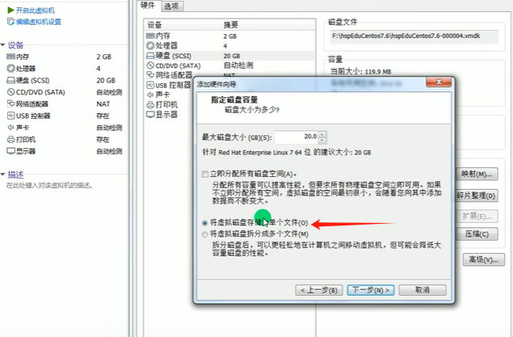

# Liunx

## 1.网络连接三种方式

1.桥接模式，虚拟系统可以和外部系统通讯，但是容易造成IP冲突

2.NAT模式，网络地址转换模式。虚拟系统可以和外部系统通讯，不造成IP冲突

3.主机模式:独立的系统 （不与外界网络连接，想怎么配，怎么配）


## 2.虚拟机克隆

> 迁移虚拟机

方式一：直接找到你安装的虚拟机，复制这个目录到新的环境，再通过vm打开即可（easy）

方式二：vm克隆，需要先关闭Linux系统。（右击你克隆的虚拟机---》管理---->克隆，根据步骤完成（采用完全克隆的方式，不采用引用的方式））

## 3.虚拟机快照

> 将系统回到初始状态或你保存的状态

右击你的虚拟机---》快照---》拍摄快照（快照管理可以查看你每次的快照）

## 4.虚拟机的迁移

> 迁移和克隆是一样的（找对安装目录即可）

## 5.vmtools的安装

**在linux中安装**

> 安装vmtools的步骤
>
> 1.进入centos点击vm菜单的->install vmware toolscentos
>
> 2.会出现一个vm的安装包，xx.tar.gz
>
> 3.拷贝到 /opt
>
> 4.使用解压命令 tar, 得到一个安装文件
>
> 5.进入该vm解压的目录，/opt 目录下
>
> 6.安装./vmware-install.pl
>
> 7.全部使用默认设置即可，就可以安装成功
>
> 注意:安装vmtools需要有gcc.

**在vm中设置**

> 基本介绍
>
> ​	为了方便，可以设置一个共享文件夹，比如d:/myshare
>
> 具体步骤
> 	1.工菜单->vm->setting,如图设置即可注意:设置选项为always enable这样可以读写了
>
> ​	2.windows和centos可共享 d:/myshare目录可以读写文件了
>
> ​	3.共享文件夹在centos的/mnt/hgfs/下
>
> **注意事项和细节说明**
>
> ​	windows 和 contos 就可以共享文件了，但是在实际开发中，文件的上传下载是需要使用 远程方式完成的
>
> 远程方式登录，借助第三方工具xfrp等

## 6.**Linux目录结构

/bin

/sbin

/home

/root

/lib

/lost/found

/etc

/usr

/boot

/proc   **不能动**

/srv  **不能动**

/sys  **不能动**

/tmp

/dev   所有的硬件都在这个文件下 （例如：硬盘）

/media

/mnt

/opt

/usr/local

/var

/selinux

## 7.Linux远程登录和文件传输

使用xshell xftp

## 8.vi vim的使用


## 9.linux关机重启

- shutdown -h now  立刻关机
- shutdown -h 1  1分钟后关机  和shutdown一样
- shutdown -r now  现在重新启动计算机
- halt  关机，作用和shutdown -h now  立刻关一样
- reboot  现在重新启动计算机
- sync **把内存的数据同步到磁盘**

**注意细节**

- ​	不管是重启系统还是关闭系统，首先要运行svnc命令，把内存中的数据写到磁盘中
- ​	目前的 shutdown/reboot/halt 等命令均已经在关机前进行了 sync ，老韩提醒: 小心驶得万年船

## 10.登录注销


> logout：注销---->在运行级别3中有效，也就是无界面

> su - root 切换到root下  ，logout则回到登录用户，再logout则退出

## 11.用户管理

### 用户

1.添加用户

> useradd  用户名      解释：添加用户
>
> useradd -d 目录  用户名   例如：useradd -d /home/test king  表示test为king用户管理的目录
>
> useradd -g 用户组 用户名   解释：增加用户时直接加上组

2.修改用户密码或设置密码

> passwd 用户名  给这个用户名设置密码或修改密码

3.删除用户

>userdel 用户名
>
>应用案例：
>
>1.删除用户，保留用户目录 -----》userdel 用户名
>
>2.删除用户和用户目录------》userdel -r 用户名 **慎重**

4.查询用户

> id 用户名

5.切换用户

> su - 用户名
>
> 注：权限高的向权限低的，不需要密码
>
> ​		回到原来用户-》》logout或exit

6.查看当前第一次登录的用户（su - 换用户后  查看的还是第一登录的用户）

> whoami  或  who am i

### 用户组

1.新增用户组

> groupadd 组名

2.删除组

> groupdel 组名

3.增加用户时直接加上组

> useradd -g 用户组 用户名

4.修改用户的组  用root用户修改组

> usermod -g 用户组 用户名
>
> usermod -d 目录名 用户名  改变改用户登录的初始目录 。 **注意：**用户需要有进入到新目录的权限

### 用户和组相关文件

/etc/passwd 文件

- 用户(user)的配置文件，记录用户的各种信息
- 每行的含义:用户名:口令(一般这里是x ，加密):用户标识号:组标识号:注释性描述:主目录:登录Shell

/etc/shadow 文件

- 口令的配置文件

- 每行的含义:登录名:加密口令(密码：加密的，！是没有密码):最后一次修改时间:最小时间间隔:最大时间间隔:警告时间:不活动时间:失效时间:标志

/etc/group 文件

- 组(group)的配置文件，记录Linux包含的组的信息
- 每行含义:组名:口令:组标识号:组内用户列表

## 12.指定运行级别

> 基本介绍运行级别说明:
> 0:关机
>
> 1:单用户 (找回丢失密码)
>
> 2:多用户状态没有网络服务  (无意义)
>
> 3.多用户状态有网络服务
>
> 4:系统未使用保留给用户 （现在无意义）
>
> 5:图形界面
>
> 6:系统重启
>
> 注意：常用运行级别是3和5，也可以指定默认运行级别（可以设置），后面演示
>
> **应用实例**
>
> 命令:init [0123456]
>
> ​    应用案例:通过init 来切换不同的运行级别，比如动 5-3 ，然后关机

### 指定默认运行级别

> 在centos7以前，/etc/inittab文件中修改
>
> centos7以后，进行了简化，如下命令
>
> - multi-user.target:类似于运行级别3
> - graphical.target:类似于运行级别5

1.查看当前默认运行级别

> systemctl get-default

2.修改默认运行级别  (例子：运行级别5)

systemctl set-default graphical.target

## 13.找回root密码

> 注意：（不同版本，不太一样，这里是centos7.6以后   这次演示的是7.6）

1.首先，启动系统，进入开机界面，在界面中按“e”进入编辑界面，如图


2.进入编辑界面，使用键盘上的上下键把光标往下移动，找到以““Linux16”开头内容所在的行数”,在行的最后面输入:init=/bin/sh。
如图


3.接者，输入完成后，直接按快捷键:Ctrl+x 进入单用户模式，
4.接着，在光标闪烁的位置中输入:`mount -o remount,rw / ` (注意:各个单词间有空格)，完成后按键盘的回车键(Entcr)。如图


5.在新的一行最后面输入:passwd， 完成后按键盘的回车键(Ener)。输入密码，然后再次确认密码即可(提示:密码长度最好8位以上,但不是必须的)，密码修改成功后，会显示passwd…的样式，说明密码修改成功


7.接着，在鼠标闪烁的位置中(最后一行中)输入:`touch /.autorelabel`(注意:touch与/后面有一个空格)，完成后按键盘的回车键(Enter)


8.继续在光标闪烁的位置中，输入:`exec /sbin/init`(注意:exec与/后面有一个空格)，完成后按键盘的回车键(Enter)，等待系统自动修改密码( 提示:这个过程时间可能有点长，耐心等待)，完成后，系统会自动重启，新的密码生效了

【可选】最后进入后，可再根据`passwd root `改你想改的密码

## 14.帮助命令

man 获得帮助信息

- 基本语法:man 命令或配置文件(功能描述:获得帮助信息)
- 案例:查看Is命令的帮助信息  `man ls`  (空格翻页)

help指令

- 基本语法:help 命令(功能描述:获得shell内置命令的帮助信息)

应用实例

- 案例:查看cd命令的帮助信息  `help cd`

百度帮助更直接
如果英语不太好的，也可以直接百度靠谱

## 15.文件目录类-pwd-ls-ln.....

> pwd：显示绝对路径

> ls
>
> ​	-l :列表显示
>
> ​	-a ：全部显示
>
> ​	-h:   展示信息更容易理解
>
> ​	-R：递归展示

> cd
>
> ​	~ :回到用户目录
>
> ​	.. :回到上级目录

> mkdir
>
> ​	-p：创建多级目录

>rmdir :只能删除空目录
>
>rm -rf   ：递归强制删除，危险

> touch  :创建文件，会修改文件时间

> cp   :拷贝指令
>
> ​	cp [选项] 源 目标
>
> ​		-r :递归拷贝
>
> ​		\cp :强制覆盖代替cp命令

> rm  :删除文件
>
> ​	-r  递归删除目录
>
> ​	-f  不提示强制删除

> mv 重命名和移动文件
>
> ​	mv 源文件  目标

> cat  ：查看文件内容
>
> ​	-n :显示行号
>
> ​	经常用法  cat -n xxx | more   :cat配合管道 查询结果用more交换   回车下行   空格翻页

> more more指令是一个基于V编辑器的文本过滤器，它以全屏幕的方式按页显示文本文件的内容。more
> 指令中内置了若干快捷键(交互的指令)，详见操作说明
>
> 

> less ::查大文件，效率好
>
> less指令用来分屏查看文件内容，它的功能与more指令类似，但是比more指令更加强大，支持各种显示终端。less指令在显示文件内容时，并不是一次将整个文件加载之后才显示，而是根据显示需要加载内容，对于显示大型文件具有较高的效率
>
> 

> echo ：输出内容到控制台
>
> ​	例如：输出环境变量：echo $HOSTNAME

> head :head用于显示文件的开头部分内容，默认情况下head指令显示文件的前10行内容
>
> ​	-n 5  :显示前5行

> tail  :tail用于输出文件中尾部的内容，默认情况下tail指令显示文件的前10行内容。
>
> ​	-n
>
> ​	-f :实时的追踪文档的更新

> 理解：能显示的都能写道文件中
>
> ·>·    输出重定向   例如：echo "hello" >  a.txt  （会覆盖）
>
> ·>>·  追加   例如：echo "hello" >>  a.txt   （追加） 
>
> 

> ln :软链接也称为符号链接，类似于windows里的快捷方式，主要存放了链接其他文件的路径
>
> 语法：`ln -s 原文件或目录 软链接名`    ：给原文件创建一个软链接  类似于win的快捷方式
>
> 应用案例  `ln -s /root /home/myroot   `
>
> `rm /home/myroot`   :删除软连接

> `history `  ：查看历史使用命令
>
> - `history 10`  :表示查看最近使用的10条命令
>
> - 通过下面方式重新执行
>
>   - `!编号`     ：这个编号是用history查看的那个命令前的编号   意思是把这个命令重新执行一遍，或者**直接重新打一遍**
>
>   - `!`字母也下，如我曾经使用过`tail`  	`!t`就会从history从下往上匹配`t`开头的，太久的不建议这样使用
>   - 那如何找久远的命令呢，先执行`history` 再按 `ctrl+r` 搜寻你想搜寻的关键字即可，搜寻规则也是从下往上匹配

## 16.时间日期指令

> date   显示当前日期
>
> 
>
> ​	-s  字符串时间    ：设置系统当前时间  例如：date -s "2024-09-04 14:02:55"

> `cal`   查看当前月份的日历
>
> `cal 2024`   :展示2024的1-12的日历

## 17.查找指令-find-locate -which-grep  

> find    find指令将从指定目录向下递归地遍历其各个子目录，将满足条件的文件或者目录显示在终端。
>
> 语法：find 搜索范围  选项
>
> 
>
> 例如：
>
> ​	find /home -name hello.txt
>
> ​	find /opt  -user nobody   :查找/opt目录下，用户名为nobody的文件
>
> ​	find / -size +200M    查找整个linux大于200M的文件  （+大于 -小于 不写则是等于  ，单位有k,M,G）


> locate  :locate指令可以快速定位文件路径。locate指令利用事先建立的系统中所有文件名称及路径的locate数据库实现快速定位给定的文件。Locate指令无需遍历整个文件系统，查询速度较快。为了保证查询结果的准确度，**管理员必须定期更新locate时刻**
>
> 基本语法
> locate 搜索文件
> 特别说明
> 由于locate指令基于数据库进行查询，所以**第一次运行前，必须使用`updatedb`指令创建locate数据库**


> which   ：可以查看某个指令在那个目录下  例如ls  which ls


> grep 和管道符号  |
>
> ​	grep 过滤查找     语法：grep  选项  查找内容  源文件  
>
> ​		-n  显示行号
>
> ​		-i  忽略大小写
>
> ​		-v 反向匹配（就是包含某个过滤条件的不要查询）
>
> ​	管道符 |  表示将前一个命令的处理结果输出传递给后面的命令处理
>
> 解释图：
>
> 
>
> cat  a.txt | grep  -n "yes"
>
> grep -n "yes"  a.text

## 18.压缩和解压

> gzip/gunzip   :压缩文件
>
> 

> zip/unzip   :zip 用于压缩文件/文件夹，unzip 用于解压文件/文件夹，这个在项目打包发布中很有用的
>
> 语法：
>
> ​	zip 选项 xxx.zip  压缩的内容
>
> ​		-r 递归压缩，即压缩目录
>
> ​	unzip 选项 xxx.zip  
>
> ​		-d<目录> 指定解压后文件的存放目录
>
> 案例：
>
> ​	zip -r xxx.zip  /home/
>
> ​	unzip -d /opt/ /home/xxx.zip			
>
> 讲解图如下：
>
> ​	 

>tar  打包和解压看选项的选择
>
>语法：
>
>​	`tar 选项  xx.tar.gz  打包内容`
>
>​	选项
>
>​		-c 产生打包文件，产生`.tar`打包文件
>
>​		-v 显示详细信息
>
>​		-f	指定压缩后的文件，这个选项是必须的，指定操作涉及的文件名
>
>​		-z	打包同时压缩，调用 giz，文件后缀是`.gz`
>
>​		-x	解包.tar文件，解包`.tar`文件
>
>​		-j     调用 bzip2，文件后缀是`.bz2`
>
>​		-Z    调用 compress，文件后缀是`.Z`
>
>
>
>案例：
>
>`tar -zxvf   xxx.tar.gz  -C /opt`  解压缩到/opt
>
>`tar -zcvf	pc.tar.gz  /home/xxx/a.txt  /home/xxx/b.txt `  打包
>
>**举一反三就有`tar -jcvf`，`tar -jxvf`，`tar -Zcvf`和`tar -Zxvf`等等**

------

## 19.linux组（难点）

> 一个文件/目录有 所有者 所在组 其他组 ；
>
> ​	所有者：某个用户对这个文件的权限，一般是谁创建谁是创建者
>
> ​	所在组：是某个组对这个文件的权限，默认是创建者所在的组
>
> ​	其他组：其余的组对这个文件的权限


### 1.所有者

> 查看文件的所有者
>
> ​	ls -ahl

> 修改文件所有者
>
> chown 用户名 文件名

### 2.所在组

> 修改文件所在组
>
> chgrp 组名 文件名

### 3.其他租

> 除文件的所有者和所在组的用户外，系统的其它用户都是文件的其它组

### 4.改变用户所在组

> 在添加用户时，可以指定将该用户添加到哪个组中，同样的用root的管理权限可以改变某个用户所在的组。
>
> - 改变用户所在组
>   - `usermod -g 新组名 用户名`
>   - `usermod -d 目录名 用户名`  改变该用户登陆的初始目录。特别说明:用户需要有进入到新目录的权限
> - 应用实例
>   - 题目：将 zwj 这个用户从原来所在组，修改到 wudang 组。
>     - 操作：`usermod -g wudang zwj`

## 20.rwx权限

> 权限配合 组 来使用

### 1.基础分析

> `ls -l `查看文件权限
>
> - -rwxrw-r-- 1 root root 1213 Feb 2 09:39 abc
>
> - 0-9位说明
>
>   1.第0位确定文件类型(d，-，l，c，b)
>
>   ​	- 是普通文件
>
>   ​	I 是链接，相当于windows的快捷方式
>
>   ​	d 是目录，相当于windows的文件夹
>
>   ​	c 是价门备文件，鼠标，键盘
>
>   ​	b 是块设备，比如硬盘
>
>   2.第1-3位确定所有者(该文件的所有者)拥有该文件的权限。---User
>
>   3.第4-6位确定所属组(同用户组的)拥有该文件的权限，---Group
>
>   4.第7-9位确定其他用户拥有该文件的权限---Other

> **讲解rwx作用并理解**（理解清楚）
>
> rwx作用到文件 （文件的对象是文件内容）
>
> - [r]代表可读(read):可以读取，查看
>
> - [w]代表可写(write): 可以修改，但是不代表可以删除该文件，**删除一个文件的前提条件是对该名件所在的目录有写权限**，才能删除该文件。
> - [x]代表可执行(execute):可以被执行
>
> rwx作用到目录 （目录的对象是文件本身）
>
> - [r]代表可读(read):    **可以读取，ls查看目录内容**，但目录下文件该有的权限还是有的
> - [w ]代表可写(write):  **可以修改,对目录内创建+删除+重命名目录**
> - [x]代表可执行(execute):    **可以进入该目录   cd操作**
>
> 注意：

> **实例讲解**
>
> `ls -l`中显示的内容如下:
> 	-rwxrw-r-- 1 root root 1213 Feb 2 09:39 abc
>
> 1.10个字符确定不同用户能对文件干什么
>
> - 第一个字符代表文件类型: - l d c b
>
> 其余字符每3个一组(rwx)读(r)写(w)执行(x)
>
> - 第一组rwx:文件拥有者的权限是读、写和执行
>
> - 第二组rw-:与文件拥有者同一组的用户的权限是读、写但不能执行
>
> - 第三组r--:不与文件拥有者同组的其他用户的权限是读不能写和执行
>
> 2.可用数字表示为:r=4,w=2,x=1因此rwx=4+2+1=7
>
> 3.其它说明
>
> 1			   文件 : 硬连接数或	目录 : 子目录数+文件数
>
> root		 用户
>
> root		 组
>
> 1213		文件大小(字节)，如果是文件夹，显示 4096字节
>
> Feb 2 09:39	最后修改日期
>
> abc		 文件名

### 2.修改文件/目录权限-chmod

> `chmod`
>
> **第一种方式: + - = 变更权限**
>
> u:所有者 g:所有组 o:其他人 a:所有人(u、g、o的总和)
>
> 1)`chmod u=rwx,g=rx,o=x 文件/目录名`
>
> 2)`chmod o+w 文件/目录名`
>
> 3)`chmod  a-X  文件/目录名`
>
> **第二种方式:通过数字变更权限**
>
> r=4 w=2 x=1
>
> rwx=4+2+1=7
>
> `chmod u=rwx,g=rx,o=x 文件目录名`相当于 `chmod 751 文件目录名`

### 3.修改文件所用者-chown

> chown
>
> ​	`chown newowner 文件/目录 `  	改变所有者
>
> ​	`chown newowner:newgroup 文件/目录`		改变所有者和所在组
>
> 选项
>
> ​	-R 如果是目录 则使其下所有子文件或目录递归生效

### 4.修改文件/目录所在组-chgrp

> chgrp
>
> ​	`chgrp newgroup 文件/目录`  	修改文件/目录所在组
>
> 选项
>
> ​	-R 如果是目录 则使其下所有子文件或目录递归生效
>
> 应用实例
>
> 使用 root用户创建文件 orange.xt,看看当前这个文件属于哪个组，然后将这个文件所在组，修改到 fnuit 组
>
> 1. `groupadd fruit ` 创建组
> 2. `toueh orange.txt` 创建文件
> 3. 看看当前这个文件属于哪个组->root 组
> 4. `chgrp fmit orange.txt` 修改文件所在组

### 案例

> 题目：
>
> police  警察组
>
> bandit  土匪组
>
> jack，jerry 	：  在警察组
> xh，xq    ：在土匪组
>
> ------
>
> 1.创建组
>
> - `groupadd police`     `groupadd bandit`
>
> 2.创建用户，并将用户放在对应组中
>
> - `useradd -g police jack `
> - `useradd -g police jerry `
> - `useradd -g bandit xh`
> - ` useradd -g bandit xq`
>
> 3.jack 创建一个文件，自己可以读r写w，本组人可以读，其它组没人任何权限
>
> - 首先iack登录:
>
>   - `vim jack.txt` 
>
>   - ` chmod 640 jack.txt`
>
> 4.jack修改该文件，让其它组人可以读，本组人可以读写
>
> - `chmod o=r,g=r jack.txt`
>
> 5.xh 投靠 警察，看看是否可以读写
>
> `usermod -g police xh`
>
> 6.测试，看看是否可以读写，xg是否可以，小结论，就是如果要对目录内的文件进行操作，需要要有对该目录的相应权限

## 21.定时任务调度

### 1.crond（重复）

> crontab 进行定时任务的设置
>
> 概述
>
> ​	任务调度:是指系统在某个时间执行的特定的命令或程序。
>
> ​	任务调度分类:
>
> ​		1.系统工作:有些重要的工作必须周而复始地执行。如病毒扫描等
>
> ​		2.个别用户工作:个别用户可能希望执行某些程序，比如对mysql数据库的备份。
>
> 快速入门
>
> - 设置任务调度文件:/etc/crontab
>
> - 设置个人任务调度。执行crontab-e命令
>
> 基本语法
>
> - crontab	[选顶]
>
> 常用选项
>
> - -e	编辑crontab定时任务
>
> - -l	查询crontab任努
>
> - -r	删除当前用户所有的crontab任务
>
> 常用命令
>
> ```shell
> crontab -e  编辑任务
> conrtab -r 	终止任务调度。全部都没了
> crontab -l  列出当前有那些任务调度
> service crond restart 	重启任务调度
> ```
>
> 
>
> 如图解释：
>
> 
>
> 


#### 入门案例

> 1.`crontabe -e`
>
> 2.在文件中输入`*/1 * * * * ls -l /etc/ > /tmp/to.txt`
>
> 解释如下：5个占位符的说明
>
> |    项目     |         含义         |          范围           |
> | :---------: | :------------------: | :---------------------: |
> | 第一个  “*” | 一小时当中的第几分钟 |          0-59           |
> | 第二个  “*” |  一天当中的第几小时  |          0-23           |
> | 第三个  “*” |  一个月当中的第几天  |          1-31           |
> | 第四个  “*” |   一年当中的第几月   |          1-12           |
> | 第五个  “*” |   一周当中的星期几   | 0-7（0和7都代表星期日） |
>
> 

#### 时间规则

| 特殊符号 |                             含义                             |
| :------: | :----------------------------------------------------------: |
|    *     | 代表任何时间，比如第一个 “*” 就代表一小时中每分钟都执行一次的意思。 |
|    ,     | 代表不连续的时间。比如“0 8,12,16 * * * 命令”，就代表在每天的8点0分，12点0分，16点0分都执行一次命令 |
|    -     | 代表连续的时间范围。比如“0 5 * * 1-6命令”，代表在周一到周六的凌晨5点0分执行命令 |
|   */n    | 代表每隔多久执行一次。比如“*/10 * * * * 命令”，代表每隔10分钟就执行一遍命令 |

#### 一些规则

| 时间              | 含义                                                         |
| ----------------- | ------------------------------------------------------------ |
| 45 22 * * * 命令  | 在22点45分执行命令                                           |
| 0 17 * * 1命令    | 每周1 的17点0分执行命令                                      |
| 0 5 1,15 * * 命令 | 每月1号和15号的凌晨5点0分执行命令                            |
| 40 4 * * 1-5 命令 | 每周一到周五的凌晨4点40分执行命令                            |
| */10 4 * * * 命令 | 每天的凌晨4点，每隔10分钟执行一次命令                        |
| 0 0 1,15 * 1 命令 | 每月1号和15号，每周1的0点0分都会执行命令。注意:星期几和几号最好不要同时出现，因为他们定义的都是天。非常容易让管理员混乱。 |
|                   |                                                              |
|                   |                                                              |

### 2.at(一次)

> 1.基本介绍
>
> 1. at命令是一次性定时计划任务，at的守护进程atd会以后台模式运行，检查作业队列来运行。
>
> 2. 默认情况下，atd守护进程每60秒检查作业队列，有作业时，会检查作业运行时间，如果时间与当前时间匹配，则运行此作业。
>
> 3. at命令是一次性定时计划任务，执行完一个任务后不再执行此任务了
>
> 4. 在使用at命令的时候，**一定要保证证atd进程的启动**，可以使用相关指令来查看
>    - `ps -ef | grep atd`
>
> 2.at命令格式
>
> ​	at [选项]  [时间]            ## **Ctrl +D 结束at命令 ---》输入2次**
>
>  [选项] 
>
> |     选项      |                           含义                           |
> | :-----------: | :------------------------------------------------------: |
> |      -m       | 当指定的任务被完成后，将给用户发送邮件，即使没有标准输出 |
> |      -I       |                        atq的别名                         |
> |      -d       |                        atrm的别名                        |
> |      -v       |                  显示任务将被执行的时间                  |
> |      -c       |                 打印任务的内容到标准输出                 |
> |      -V       |                       显示版本信息                       |
> |   -q <队列>   |                      使用指定的队列                      |
> |   -f <文件>   |          从指定文件读入任务而不是从标准输入读入          |
> | -t <时间参数> |             以时间参数的形式提交要运行的任务             |
>
> [时间]  
>
> > at时间定义:
> >
> > 1.接受在当天的hh:mm(小时:分钟)式的时间指定。假如该时间已过去，那么就放在第二天执行。 例如:04:00
> >
> > 2.使用midnight(深夜)，noon(中午)，teatime(饮茶时间，一般是下午4点)等比较模糊的词语来指定时间。
> >
> > 3.采用12小时计时制，即在时间后面加上AM(上午)或PM(下午)来说明是上午还是下午。例如:12pm
> >
> > 4.指定命令执行的具体日期，指定格式为monthday(月 日)或mm/dd/yy(月/日/年)或dd.mm.yy(日.月.年)，指定的日期必须跟在指定时间的后面。例如:04:00 2021-03-1
> >
> > 5.使用相对计时法。指定格式为:now+counttime-units，now就是当前时间，time-units是时间单位这里能够是minutes(分钟)、hours(小时)、days(天)、weeks(星期)。count是时间的数量，几天，几小时。例如:now+5minutes
> >
> > 6.直接使用today(今天)、tomorrow(明天)来指定完成命令的时间。
>
> 3.其他命令
>
> ```shell
> ps -ef | grep atd  ##先看看atd是否后台运行 一定要有才能用at命令
> 
> #at的使用
> at 5pm + 2 days  ##2天后下午5点中执行
> /bin/ls /home  ##输入内容，结束后按两次 ctrl+D
> 
> atq   ##查看系统中要执行的工作任务
> atrm 编号  ##删除此编号的任务
> ```
>
> 4.原理解释：
>
> 
>
> 5.案例：
>
> > 


## 22.磁盘分区

### 1.概念

> 原理介绍
>
> ​	Linux来说无论有几个分区，分给哪一目录使用，它归根结底就只有一个根目录，一个独立且唯一的文件结构，Linux中每个分区都是用来组成整个文件系统的一部分。
>
> ​	Linux采用了一种叫“载入”的处理方法，它的整个文件系统中包含了一整套的文件和目录，且将个分区和一个目录联系起来。这时要载入的一个分区将使它的存储空间在一个目录下获得。
>
> 示例图：
>
> 


> linux**硬盘说明**
>
> 1. Linux硬盘分IDE硬盘和SCSI硬盘，目前基本上是SCSI硬盘
>
> 2. 对于IDE硬盘，驱动器标识符为“hdx~”,其中“hd”表明分区所在设备的类型这里是指IDE硬盘“x”为盘号(a为基本盘，b为基本从属盘，c为辅助主盘，d为辅助从属盘“~”代表分区前四个分区用数字1到4表示，它们是主分区或扩展分区，从5开始就是逻辑分区。例，hda3表示为第一个IDE硬盘上的第三个主分区或扩展分区,hdb2表示为第二个IDE硬盘上的第二个主分区或扩展分区。
>
> 3. 对于SCSI硬盘则标识为“sdx~”，SCSI硬盘是用“sd”来表示分区所在设备的类型的，其余则和IDE硬盘的表示方法一样。

### 2.命令-lsblk：

> - 查看所有设备挂载情况
>   - `lsblk `或者`lsblk -f`
>
> - 结果解释
>
> 
>
> 

### 3.增加磁盘应用实例

> 说明:
>
> ​	下面我们以增加一块硬盘为例来熟悉下磁盘的相关指令和深入理解磁盘分区、挂载、卸载的概念。
>
> 问题：如何增加一块硬盘
>
> 1. 虚拟机添加硬盘
>
>    - 在【虚拟机】菜单中，选择【设置】，然后设备列表里添加硬盘，然后一路【下一步】，中间只有选择磁盘大小的地方需要修改，至到完成。然后重启系统(才能识别)
>
> 2. 分区
>
>    - 解释：分区命令`fdisk /dev/sdb`  解释：给sdb硬盘分区  （sdb，其中b是代表第二块硬盘，具体看上方的**硬盘说明**）
>
>      - 开始对/sdb分区
>
>      - | 指令 |          说明           |
>        | :--: | :---------------------: |
>        |  m   |      显示命令列表       |
>        |  p   | 显示磁盘分区同 fdisk -l |
>        |  n   |        新增分区         |
>        |  d   |        删除分区         |
>        |  w   |       写入并退出        |
>
>     - **具体操作**
>
>       - 输入`fdisk /dev/sdb`开始分区
>       - 输入n，新增分区，然后选择p，分区类型为主分区。  （选择说明：e 为扩展分区）
>       - 输入1  (这里代表创建分区1)
>       - 两次回车默认剩余全部空间。
>       - 最后输入w写入分区并退出，若不保存退出输入q
>
>     - 再次输入`lsblk`，则看到sdb硬盘下出现分区sdb1
>
> 3. 格式化（给分区指定文件类型）
>
>    - 可以先看下`lsblk -f`，发现新建的分区没有文件类型
>    - **格式化操作**
>      - `mkfs -t ext4 /dev/sdb1`    其中ext4是分区类型 （多个分区 ，多次格式化）
>      - 再次查看`lsblk -f`，发现有uuid和文件类型了
>
> 4. 挂载--mount（挂载是将一个分区与一个目录联系起来）
>
>    - **注意：目前为止，命令行挂载是临时的，想要永久则将第五步完成**
>    - 语法：
>      - `mount 设备名称 挂载目录`
>    - **实操操作**
>      - 创建目录`mkdir newdisk`，（此目录是要挂载的目录,这里是根目录创建的，挂载的目录在哪都可以）
>      - 挂载`mount /dev/sdb1 /newdisk/`
>      - 再次查看`lsblk -f `，发现分区的目录也挂载好了 ，这样在此目录下的内容就都存放在新建的分区里面了
>
> 5. 设置可以自动挂载
>
>    - 永久挂载：修改 /etc/fstab 实现：  `vim /etc/fstab`  ，按照下面的方式添加信息，保存重启reboot
>      - 1.方式一：按照原有格式（使用uuid），添加信息
>      - 2.方式二：找到新建的分区的路径也可以，如图：
>      - 
>    - 添加完成后，不重启，则执行`mount -a` 即可生效
>
>  **注意：命令行挂载是临时的，重启失效，采用配置文件的方式是永久的（原理是：开机会读取配置文件）**
>
> ------
>
> 6. 多说一点，卸载分区
>    - 语法：
>      - `umount 设备名称 `   或者  `umount 挂载目录`
>        - 例如：`umount /dev/sdb1   或者   umount /newdisk`
>
> 理解图：
>
> 

### 4.磁盘情况查询

1.查询系统整体磁盘使用情况

> df -h
>
> 注意：使用量到达80%，要想办法了
>
> 

2.查询指定目录的磁盘占用情况

> du -h  [目录可选]		解释：查询指定目录的磁盘占用情况，默认为当前目录
>
> - 参数
>
>   - -s 指定自录占用大小汇总·、
>
>   - -h 带计量单位
>
>   - -a 含文件
>
>   - --max-depth=1 子目录深度
>
>   - -c 列出明细的同时，增加汇总值
>
> 案例
>
> - `du -ha --max-depth=1 /opt` 这样更清晰
> - 

3.**磁盘实用指令**

> 1.统计/opt文件夹下文件的个数
>
> `ls -l /opt | grep "^-" | wc -l`
>
> 2.统计/opt文件夹下目录的个数
>
> `ls -l /opt | grep "^d" | wc -l`
>
> 3.统计/opt文件夹下文件的个数，包括子文件夹里的
>
> `ls -lR /opt | grep "^-" | wc -l`
>
> 4.统计/opt文件夹下目录的个数，包括子文件夹里的
>
> `ls -lR /opt | grep "^d" | wc -l`
>
> 5.以树状显示目录结构 （**注意：**如果没有tree ，则`yum install tree`）
>
> `tree /home/`

## 23.网络配置

### 基础

1.网络理解图


2.上面的虚拟机ip 192.168.2.x ，为什么前缀是这个

> 查看vm上方的选项卡----》虚拟网络编辑器---》点击vm8


3.查看网络ip和网关

> - win
>   - 在cmd中 输入`ipconfig`
> - linux
>   - `ifconfig`

4.ping 测试网络连接情况

> ping ip

### linux网络配置

> - 第一种方法(自动获取)
>
>   - 说明:登陆后，通过界面的来设置自动获取ip，特点:linux启动后会自动获取IP,缺点是每次自动获取的ip地址可能不一样。
>
> - 第二种方法(指定ip)
>
>   - 1.说明直接修改配置文件来指定IP，并可以连接到外网(程序员推荐)
>
>     - 编辑 `vim /etc/sysconfig/network-scripts/ifcfg-ens33`
>
>   - 2.要求:将ip地址配置的静态的，比如:ip地址为192.168.200.130
>
>     - ifcfg-ens33 文件说明（下面改的，要改，没有则添加，其余不懂，可能每个电脑文件不一样）
>
>     - ```shell
>       DEVICE=ets33 	#接口名(设备,网卡)
>       HWADDR=00:0C:2x:6x:0x:xx #MAC地址
>       TYPE=Ethernet   #网络光型(通常是Ethemct)
>       UUID=926a57ba-92c6-4231-bacb-f27c5c6a9f44    #随机id
>               
>       #系统启动的时候网络接口是否有效(yes/no)-------改yes,
>       ONBOOT=yes
>       #IP的配置方法[none|static|bootp|dhcp] (引导时不使用协议|静态分配IP|BOOTP协议|DHCP协议)---改static
>       BOOTPROTO=static
>       #IP地址----改（没有，写一个ip）
>       IPADDR=192.168.200.130
>       #网关----改（没有，写一个ip）
>       GATEWAY=192.168.200.2
>       #域名解析器----改（没有，写一个ip）
>       DNS1=192.168.200.2
>       ```
>
>   - 3.再从vm中打开虚拟网络编辑器
>
>     - 点击v8网络，修改下面的子网ip：192.168.200.0（因为两边的网段要一致）
>     - 在点击NAT设置，修改里面的网关ip：192.168.200.2 （要和linux系统中的网关一致）
>
>   - 4.重启生效，`reboot`  或   `service network restart`

### 设置主机名和hosts映射

1.设置主机名

> 1.设置主机名
>
> - 为了方便记忆，可以给linux系统设置主机名，也可以根据需要修改主机名
>
> 2.指令: :查看主机名
>
> -  `hostname`		
>
> 3.修改
>
> - 件在/etc/hostname 指定
>
> 4.修改后，重启生效  `reboot`

2.设置hosts映射

> **思考:如何通过 主机名能够找到(比如ping)某个linux系统?**
>
> -  windows
>    - 在C:\Windows\System32\drivers\etc\hosts 文件指定即可
>      - 案例: 192.168.200.130 hspedu100
>        - 操作：修改hosts文件，添加192.168.200.130 hspedu100
>
> -  linux
>    - 在/etc/hosts 文件 指定 	
>      - 案例: 192.168.200.1 ThinkPad-PC
>        - 操作：`vim /etc/hosts`	添加192.168.200.1 ThinkPad-PC

### 主机名解析过程分析

1.概念：

> Hosts是什么
>
> - 一个文本文件，用来记录IP 和 Hostname(主机名)的映射关系
>
> DNS
>
> - DNS，就是Domain Name System的缩写，翻译过来就是域名系统
> - 是互联网上作为域名和IP地址相互映射的一个分布式数据库

2.dns解析过程：浏览器缓存---》电脑DNS缓存---》本地hosts文件----》网络中DNS域名服务

> **应用实例:用户在浏览器输入了 www.baidu.com**
>
> 1.浏览器先检查浏览器缓存中有没有该域名解析IP地址，有就先调用这个IP完成解析;如果没有，就DNS解析器缓存，如果有直接返回IP完成解析。这两个缓存，可以理解为 本地解析器缓存
>
> 2.一般来说，当电脑第一次成功访问某一网站后，在一定时间内，浏览器或操作系统会缓存他的IP地址(DNS解析记录)。如在cmd窗口中输入
>
> - `ipconfig /displaydns`	//DNS域名解析缓存
>
> - `ipconfig /flushdns`	//手动清理dns缓存
>
> 3.如果本地解析器缓存没有找到对应映射，检查系统中hosts文件中有没有配置对应的域名IP映射，如果有，则完成解析并返回。
>
> 4.如果 本地DNS解析器缓存 和 hosts文件 中均没有找到对应的IP则到域名服务DNS进行解析域

理解图：（这个图少了浏览器缓存，因为可能是通过ping来执行的）


## 24.进程-ps

### 1.基础介绍

> 在LINUX中，每个执行的程摩都称为一个进程。每一个进程都分配一个ID号(pid,进程号)。=>windows =>linuX
>
> 2.每个进程都可能以两种方式存在的。前台与后台，所谓前台进程就是用户目前的屏幕上可以进行操作的。后台进程则是实际在操作，但由于屏幕上无法看到的进程，通常使用后台方式执行。
>
> 3.一般系统的服务都是以后台进程的方式存在，而且都会常驻在系统中。直到关机才才结束。

> **进程和程序的区别**
>
> 

### 2.命令-ps

> ps    :用来查看目前系统中，有哪些正在执行，以及它们执行的状况。可以不加任何参数
>
> 显示的结果：
>
> - pid	      进程识别号
> - TTY         终端机号
> - TIME      此进程所消CPU时间
> - CMD      正在执行的命令或进程名
>
> 语法：
>
> - -a  显示当前终端的所有进程信息
> - -u  以用户的格式显示进程信息
> - -x  显示后台进程运行的参数
> - -e  显示所用进程
> - -f  全格式


> `ps -aux `    或 `ps -aux | grep sshd`   或 `ps -ef | grep sshd `
>
> 显示结果：
>
> |  标题   |                             解释                             |
> | :-----: | :----------------------------------------------------------: |
> |  USER   |                           用户名称                           |
> |   PID   |                            进程号                            |
> |  %CPU   |                     进程占用CPU的百分比                      |
> |  %MEM   |                   进程占用物理内存的百分比                   |
> |   VSZ   |                进程占用的虚拟内存大小(单位:KB                |
> |   RSS   |                进程占用的物理内存大小(单位:KB                |
> |   TTY   |                        终端名称,缩写                         |
> |  STAT   | 进程状态，其中S-睡眠，s-表示该进程是会话的先导进程，N-表示进程拥有比普通优先级更低的优先级，R-正在运行，D-短期等待，**Z-僵死进程(程序死了，还在占用内存，需要手动清理)**，T-被跟踪或者被停止等等 |
> | STARTED |                        进程的启动时间                        |
> |  TIME   |                CPU时间，即进程使用CPU的总时间                |
> | COMMAND |        启动进程所用的命令和参数，如果过长会被截断显示        |
>
> 如图：
>
> 

### 3.应用实例-ps -ef

> `ps -ef `以全格式显示当前所有的进程，查看进程的**父进程** 
>
> 结果展示：
>
> | 标题  |                             说明                             |
> | :---: | :----------------------------------------------------------: |
> |  UID  |                            用户ID                            |
> |  PID  |                            进程ID                            |
> | PPID  |                           父进程ID                           |
> |   C   | CPU用于计算执行优先级的因子。数值越大，表明进程是CPU密集型运算，执行优先级会降低数值越小，表明进程是I0密集型运算，执行优先级会提高 |
> | STIME |                        进程启动的时间                        |
> |  TTY  |                        完整的终端名称                        |
> | TIME  |                           CPU时间                            |
> |  CMD  |                   启动进程所用的命令和参数                   |
>
> 

### 4.终止进程-kill killall

> 介绍:
>
> - 若是某个进程执行一半需要停止时，或是已消了很大的系统资源时，此时可以考虑停止该进程。使用ki命令来完成此项任务。
>
> 基本语法
>
> - kill [选项]   进程号    :(功能描述:通过进程号杀死/终止进程)
> - killall 进程名称   : (功能描述:通过进程名称杀死进程（**包括子进程**），也支持通配符，这在系统因负载过大而变得很慢时很有用)
>
> 常用选项
>
> - -9  表示强迫进程立即停止

### 5.pstree指令

> 进程树展示进程之间的关系

>基本语法
>
>- pstree  [选项]             ::可以更加直观的来看进程信息
>
>常用选项
>
>- -p	显示进程的PID
>- -u 	显示进程的所属用户
>
>应用实例:
>
>- 案例1:请你树状的形式显示进程的pid
>- `pstree -p`
>- 案例2:请你树状的形式进程的用户
>- `pstree -u`

## 25.服务管理

### 1.服务初步了解

> 介绍:
>
> 服务(service)本质就是进程但是是运行在后台的，通常都会监听某个端口，等待其它程序的请求，比如(mysqld，sshd 防火墙等)因此我们又称为守护进程，是Linux中非常重要的知识点。[原理图]
>
> 
>
> service管理指令
>
> - 1.`service 服务名  [start|stop|restart |reload |status]`
> - 2.在CentOS7.0后很多服务不再使用service,而是 systemctl(后面专门讲)
> - 3.service 指令管理的服务在 /etc/init.d 查看   (这里可以查看service能管理的服务---》绿色的是服务)
>   - 方式1：`ls -l /etc/init.d` 
>     - 
>   - 方式2：`setup`   查看所有的服务
>     - 

### 2.服务的运行级别(runlevel):

> 1.Linux系统有7种运行级别(runlevel):**常用的是级别3和5**
>
> - 运行级别0:系统停机状态，系统默认运行级别不能设为0，否则不能正常启动
> - 运行级别1:单用户工作状态，root权限，用于系统维护，禁止远程登陆
> - 运行级别2:多用户状态(没有NFS)，不支持网络
> - 运行级别3:完全的多用户状态(有NFS)，登陆后进入控制台命令行模式
> - 运行级别4:系统未使用，保留
> - 运行级别5:X11控制台，登陆后进入图形GUI模式
> - 运行级别6:系统正常关闭并重启，默认运行级别不能设为6，否则不能正常启动
>
> 2.设置对应级别
>
> - > 在centos7以前，/etc/inittab文件中修改
>   >
>   > centos7以后，进行了简化，如下命令
>   >
>   > - **multi-user.target:类似于运行级别3**
>   > - graphical.target:类似于运行级别5
>
>   1.查看当前默认运行级别
>
>   - `systemctl get-default`
>
>   2.修改默认运行级别  (例子：运行级别5)
>
>   - `systemctl set-default graphical.target`
>
> 3.开机的流程说明
>
> ​	开机=====>BIOS=====>/boot=====>systemd进程1=====>运行级别=====>运行级对应的服务

### 3.设置服务在各个级别中的自 启动/关闭-chkconfig指令

1.chkconfig指令  ，一个服务在不同的启动级别，自启动是不同的

> 介绍
>
> - 通过chkconfig 命令可以给服务的各个运行级别设置自 启动/关闭
> - chkconfig 指令管理的服务在 /etc/init.d 查看
> - 注意:Centos7.0后，很多服务使图aystemctl管理(后面马上讲)
>
> 
>
> chkconfig基本语法
>
> - 查看服务 chkconfig --list [| grep xxx]   #查看各个级别，服务的情况
> - chkconfig 服务名 --list       #查看某个服务在各个级别的情况
> - chkconfig --level 5 服务名 on/off      #设置某个服务在某个级别是自启动/关闭
>
> 
>
> 案例演示:对network服务 进行各种操作：：把network 在3运行级别,关闭自启动
>
> - `chkconfig --level 3 network off`     #3级别关闭
>
> - `chkconfig --level 3 network on `     #3级别打开
>
> 
>
> > **使用细节:**chkconfig重新设置服务后自启动或关闭，需要重启机器reboot生效

### 4.systemctl的使用

systemctl管理指令

> 1.基本语法:
>
> - `systemctl [start | stop | restart | status] 服务名`
>
> - systemctl指令管理的服务在`/usr/lib/systemd/system` 查看
>
> 2.systemctl设置服务的自启动状态 (Centos7以后，默认是3和5)
>
> - `systemctl list-unit-files [| grep 服务名] `(查看服务开机启动状态,grep 可以进行过滤)
>
> - `systemctl enable 服务名`     (设置服务开机启动)
>
> - `systemctl disable 服务名 `    (关团服务开机启动)
> - `systemctl is-enabled 服务名`    (查询某个服务是否是自启动的)
>
> 3.应用案例:
>
> - 查看当前防火墙的状况，关闭防火墙和重启防火墙。
>   - `systemctl status firewall`
>   - `systemctl stop firewall`
>   - `systemctl start firewall`
>
> 4.细节讨论:
>
> - 1.关闭或者启用防火墙后，会立即生效。[teInet 测试 某个端口即可]
> - 2.**案例这种方式只是临时生效**，当重启系统后，还是回归以前对服务的设置。
> - 3.如果希望**设置某个服务自启动或关闭永久生效**，要使用 `systemctl [enable|disable] 服务名`。
>
> 5.telnet的使用
>
> - 在win系统中的cmd里执行telnet测试某个服务的端口能不能连接
>   - `telnet ip 端口`
>
> 6.看看网络状态-netstat
>
> - `netstat -anp `

### 5.防火墙

> 1.防火墙打开或者关闭指定端口
>
> > 在真正的生产环境，往往需要将防火墙打开，但问题来了，，如果我们把防火墙打开，那么外部请求数据包就不能跟服务器监听端口通讯。这时，需要打开指定的端口。比如80、22、8080等，这个又怎么做呢?老韩给给大家讲一讲。
> >
> > 理解图：
> >
> > 
>
> 2.firewall指令
>
> - 打开端口:`firewall-cmd --permanent --add-port=端囗号/协议`
> - 关团端口:`firewall-cmd --permanent --remove-port=端囗号/协议`
> - 重新载入,才能生效:`firewall-cmd --reload`
> - 查询端口是否开放:`firewall-cmd --query-port=端口/协议`
> - 查看已经开放的端囗号：`firewall-cmd --zone=public --list-ports` 
>
> 3.怎么知道端口的协议是什么协议呢  #下面命令第一列就是协议
>
> - `netstat -anp`     
>
> 4.应用案例:
>
> - 启用防火墙，测试 111端口是否能 telnet
> - 开放111端口，下面都要执行
>   - `firewall-cmd --permanent --add-port=111/tcp`
>   - `firewall-cmd --reload`
> - 再次关闭111端口
>   - `firewall-cmd --permanent --remove-port=111/tcp`
>   - `firewall-cmd --reload`
>

## 26.动态监控进程-top

### 1.介绍:

> 介绍:
>
> > top与ps命令很相似。它们都用来显示正在执行的进程。Top与ps最大的不同之处，在于top在执行一段时间可以更新正在运行的的进程。
>
> 基本语法
>
> - top [选项]
>
> 选项说明
>
> - |  选项   |                             功能                             |
>   | :-----: | :----------------------------------------------------------: |
>   | -d 秒数 | 指定top命令每隔几秒更新。默认是3秒    例如top -d 5  #每5s刷新一次 |
>   |   -i    |                使top不显示任何闲置或者死进程                 |
>   |   -p    |         通过指定监控进程ID来仅仅监控某个进程的状态。         |
>
> 结果讲解：
>
> 
>
> 

### 2.交换操作-top

> 交互操作说明:
>
> | 操作 |             功能              |
> | :--: | :---------------------------: |
> |  P   | 以CPU使用率排序，默认就是此项 |
> |  M   |      以内存的使用率排序       |
> |  N   |           以PID排序           |
> |  q   |            退出top            |
>
> 应用实例
>
> - 案例1.监视特定用户
>
>   - 1.输入`top`命令，按回车键，查看执行的进程
>
>   - 2.然后输入“u”回车，再输入用户名，即可
> - 案例2:终止指定的进程。
>   - 1.输入`top`命令，按回车键，查看执行的进程。
>   - 2.然后输入`k`回车，再输入要结束的进程ID号，若要求输入信号量则输入 `9`   (9为强制杀死进程)
> - 案例3:指定系统状态更新的时间(每隔10秒自动更新)
>   - `top -d 10`

## 27.监控网络状态-netstat

查看系统网络情况netstat

> 1.基本语法
>
> `netstat [选顶]`
>
> 2.选项说明
>
> - -an   按一定顺序排列输出
>
> - -p    显示哪个进程在调用 (会显示进程id和名称)
>
> 3.应用案例
>
> - 请查看服务名为 sshd 的服务的信息。
>   - `netstat -anp | grep sshd`
>
> 4.检测主机连接命令
>
> - ping:是-种网络检测工具，它主要是用检测远程主机是否正常，或是两部主机间的网线或网卡故障。如: ping 对方ip地址
>   - ping www.baidu.com
>
> 5.结果说明：
>
> 

## 28.rpm管理

### 1.介绍

> 介绍
>
> > rpm用于互联网下载包的打包及安装工具，它包含在某些Linux分发版中。它生成具有.RPM扩展名的文件。RPM是RedHat Package Manager(RedHat软件包管理工具)的缩写，类似windows的setup.exe，这一文件格式名称虽然打上了RedHat的标志，但理念是通用的
>
> > Linux的分发版本都有采用(suse,redhat,centos 等等)，可以算是公认的行业标准了

### 2.rpm包的简单查询指令

> 1.rpm包的简单查询指令
>
> - 查询已安装的rpm列表 
>   -  `rpm -qa |  grep xx`
>
> 2.举例:看看当前系统，是否安装了firefox
>
> -  `rpm -qa |  grep firefox`
>
> 3.rpm包名基本格式
>
> - 一个rpm包名:   firefox-60.2.2-1.el7.centos.x86 64，如下解释
>
>   - 名称:firefox
>
>   - 版本号:60.2.2-1
>
> - 适用操作系统:el7.centos.x86 64
>
>   - 表示centos7.x的64位系统
>
>   - 如果是i686、i386表示32位系统，noarch表示通用

### 3.rpm包的其他查询指令：

>1.rpm包的其它查询指令:
>
>- `rpm -qa`		 :查询所安装的所有rpm软件包
>
>- `rpm -qa | more`
>
>- `rpm -qa | grep X `     :比如：`rpm -qa | grep firefox `
>
>
>
>2.`rpm -q 软件包名 `    :查询软件包是否安装
>
>- 案例:   `rpm -q firefox`
>
>
>
>3.`rpm -qi 软件包名`   :查询软件包信息
>
>- 案例: `rpm -qi firefox `
>
>
>
>4.`rpm -ql 软件包名`     :查询软件包中的文件
>
>- 比如:`rpm -ql firefox`
>
>
>
>`rpm -qf 文件全路径名 `     查询文件所属的软件包
>
>- `rpm -qf /etc/passwd`
>
>- `rpm -qf /root/install.log`

### 4.卸载rpm包

卸载rpm包

> 1.基本语法
>
> - rpm -e RPM包的名称 //erase 
>
> 2.应用案例
>
> - 删除firefox 软件包(不用写很全的名称，包的开头就行，但包名要写清楚)
>   - `rpm -e firefox`
>
> 3.细节讨论
>
> - 1.如果其它软件包依赖于您要卸载的软件包，卸载时则会产生错误信息
>
>   - 如：`rpm -e foo`
>
>     - > removing these packages would break dependencies:foo is needed by bar-1.0-1
>
> - 2.如果我们就是要删除 foo这个rpm 包，可以增加参数 --nodeps,就可以强制删除，但是一般不推荐这样做，因为依赖于该软件包的程序可能无法运行
>
>   - 如: `rpm -e --nodeps foo`

### 5.安装rpm

安装rpm包

> 1.基本语法
>
> - `rpm -ivh RPM包全路径名称`
>
> 2.参数说明
>
> - i=install 安装
>
> - v=verbose 提示
>
> - h=hash 进度条
>
> 

## 29.yum

### 介绍

> 1.介绍:
>
> > Yum 是一个Shell前端软件包管理器。基于RPM包管理，能够从指定的服务器自动下载RPM包并且安装，可以**自动处理依赖性关系**，并且一次安装所有依赖的软件包
> >
> > - 原理图
> >   - 
>
> 2.yum的基本指令
>
> - 1.查询yum服务器是否有需要安装的软件
>   - `yum list | grep xx`  #软件列表
>
> - 2.安装指定的yum包
>   - `yum install xxx `   #下载安装
>
> 3.yum应用实例
>
> - 案例:请使用yum的方式来安装firefox
>   - `rpm -e firefox`     #先删除已有的firefox
>   - `rpm list | grep firefox `    #查看yum服务上有那些firefox
>   - `yum install firefox`    #下载安装想要的版本

# 安装java环境

### 1.jdk

> 1.`mkdir /opt/jdk`
>
> 2.将jdk包通过xftp6 上传到 /opt/jdk下
>
> 3.`cd /opt/jdk`
>
> 4.解压 `tar -zxvf jdk-8u261-linux-x64.tar.gz`
>
> 5.`mkdir /usr/local/java`
>
> 6.`mv /opt/jdk/jdk1.8.0_261 /usr/local/java`
>
> 7.配置环境变量的配置文件  `vim /etc/profile`
>
> 8.再配置文件的最后面输入下面内容
>
> ```
> export JAVA_HOME=/usr/local/java/jdk1.8.0 261
> export PATH=$JAVA_HOME/bin:$PATH
> ```
>
> 9.`source /etc/profile`  [让新的环境变量生效]

### 2.tomcat8

### 3.idea2020

### 4.mysql5.7

> **注：centos7.6自带的类mysql数据库是mariadb，会跟 mysql冲突，要先删除**
>
> - `rpm -qa | grep mari`
> - `rpm -e --nodeps mariadb-libs`

# 大数据-shell编程

## 1.入门

> shell是什么
>
> > Shell是一个命令行解释器，它为用户提供了一个向Linux内核发送请求以便运行程序的界面系统级程序用户可以用Shell来启动、挂起、停止甚至是编写一些程序。看一个示意图
> >
> > 


> Shell脚本的执行方式
>
> 1.脚本格式要求
>
> - 脚本以#!/bin/bash开头
> - 脚本需要有可执行权限
>
> 
>
> 2.编写第一个Shell脚本
>
> - 需求说明:创建一个Shell脚本，输出hello world!
>
>   ```shell
>   #!/bin/bash
>   echo "hello,world~"
>   ```
>
> 3.脚本的常用执行方式
>
> - 方式1(输入脚本的绝对路径或相对路径)
>   - 说明:首先要赋予helloworld.sh 脚本的+x权限(`chmod u+x xxx.sh`)，再执行脚本。如：`./xxx.sh`  或  `/root/shcode/xxx.sh`
>
> - 方式2(sh+脚本)说明:不用赋予脚本+x权限，直接执行即可。如：`sh xxx.sh`

## 2.Shell 变量

1.Shell变量

> 1.Shell变量
>
> - 介绍Linux Shell中的变量分为，系统变量和用户自定义变量
>
> - 系统变量:`$HOME、$PWD、$SHELL、$USER`等等，比如:`echo $HOME `等等
>
> - 显示当前shell中所有变量:`set`
>
> 2.shell变量的定义
>
> - 基本语法
>
>   - 定义变量:变量=值
>
>   - 撤销变量:`unset 变量`.
>
>   - 声明静态变量:`readonly 变量 `，注意：不能`unset`
>
> - 快速入门
>
>   - 案例1:定义变量A
>
>   - 案例2:撤销变量A
>
>   - 案例3:声明静态的变量B=2，不能unset
>
>     ```shell
>     #案例一
>     A=100
>     echo A=$A
>     #案例二
>     unset A
>     echo A=$A
>     #案例三
>     #不能unset B
>     readonly B=2
>     
>     ```
>
>   - 案例4:可把变量提升为全局环境变量，可供其他shel程序使用[该案例后面讲]

2.shell变量的定义

> 1.定义变量的规则
>
> - 变量名称可以由字母、数字和下划线组成，但是不能以数字开头。5A=200(x)
>
> - 等号两侧不能有空格
> - 变量名称一般习惯为大写
>
> 2.将**命令**的返回值赋给变量
>
> - A=\`date\`反引号，运行里面的命令，并把结果返回给变量A
>
> - A=$(date)等价于反引号

## 3.设置环境变量

入门

> 1.基本语法
>
> - 1.export 变量名=变量值   (功能描述:将shell变量输出为环境变量/全局变量)
>
> - 2.source 配置文件   (功能描述:让修改后的配置信息立即生效)
>
> - 3.echo $变量名    (功能描述:查询环境变量的值)
>
> 2.快速入门
>
> - 1.在`/etc/profile`文件中定义TOMCAT_HOME环境变量
>
> - 2.查看环境变量TOMCAT HOME的值
>
> - 3.在另外一个shell程序中使用 TOMCAT_HOME
>
> 注意:在输出TOMCAT_HOME 环境变量前，需要让其生效
>
> `source /etc/profile`
>
> 3.为什么设置环境变量（看图）
>
> 
>
> 4.注释
>
> - 单行注释：`#`
>
> - 多行注释：`:<<!`  `!` 必须单独一行
>
>   ```shell
>   :<<!
>   内容~
>   !
>   ```
>
> 

## 4.位置参数变量

> 1.介绍
>
> > 当我们执行一个shel脚本时，如果希望获取到命令行的参数信息，就可以使用到**位置参数变量**
> >
> > 比如 :`./myshell.sh 100 200`,这个就是一个执行shell的命令行，可以在myshell 脚本中获取到参数信息
>
> 2.基本语法
>
> - `$n` (功能描述:n为数字，$0代表命令本身，$1-$9代表第一到第九个参数，十以上的参数，十以上的参数需要用大括号包含，如${10})
>
> - `$*`(功能描述:这个变量代表命令行中所有的参数，$*把所有的参数看成一个整体,所以循环的时候是一次)
>
> - `$@`(功能描述:这个变量也代表命令行中所有的参数，不过`$@`把每个参数区分对待，这里是有多少循环多少)
>
> - `$#`(功能描述:这个变量代表命令行中所有参数的个数)
>
> 3.位置参数变量
>
> 案例:编写一个shell脚本 position.sh ，在脚本中获取到命令行的各个参数信息。
>
> ```shell
> #!/bin/bash
> echo "0=$0 1=$1 2=$2"
> echo "所有参数=$*"
> echo "$@"
> echo "参数的个数=$#"
> ```
>
> 

## 5.预定义变量

介绍（用的不多）

>1.基本介绍
>
>> 就是shell设计者事先已经定义好的变量，可以直接在shel脚本中使用
>
>2.基本语法
>
>- `$$`   (功能描述:当前进程的进程号(PID))
>
>- `$!`    (功能描述:后台运行的最后一个进程的进程号(PID))
>
>- `$?`    (功能描述:最后一次执行的命令的返回状态。如果这个变量的值为0，证明上一个命令正确执行如果这个变量的值为非0(具体是哪个数，由命令自己来决定)，则证明上一个命令执行不正确了。)
>
>3.应用实例
>
>- 在一个shell脚本中简单使用一下预定义变量
>- 
>
>

## 6.运算符

> 1.基本介绍
>
> > 学习如何在shel中进行各种运算操作。
>
> 2.基本语法
>
> - 1.`$((运算式))`或`$[运算式]`或者 `expr m + n `        #其中expr是expression这个单词的缩写，中文是表达式的意思
>   - 注意expr运算符间要有空格，如果希望将 expr 的结果赋给某个变量，使用\`\`
>
> - 3.`expr m - n`
>
> - 4.`expr`  `\*`，`/`，`% `      #分别是==》**乘**（要注意），除，取余
>
> 3.应用实例
>
> - 案例1:计算(2+3*4的值
> - 案例2:请求出命令行的两个参数[整数]的和
>   - 

## 7.条件判断

1.判断语句

> 1.基本语法
>
> - `[ condition ]`(注意condition前后要有空格)  
>   - #condition 为你输入的条件，非空返回true，可使用$?验证(0为true，>1为false)
>
> 应用实例
>
> - [ hspEdu ]    这个条件返回true
> - \[ \]					这个条件返回false
> - `[ condition  ] && echo OK || echo notok`    条件满足，执行后面的语句
>   - 例如：确保备份目录存在,创建备份目录，如果不存在，就创建`[ ! -d "${BACKUP}/${DATETIME}" ] && mkdir -p "${BACKUP}/${DATETIME}"`

2.条件判断

> 1.判断语句常用判断条件
>
> - 1.= 字符串比较
>
> - 2.两个整数的比较
>   - -lt 小于
>   - -le 小于等于    # little equal的简写
>   - -eq 等于-gt 大于
>   - -ge 大于等于
>   - -ne 不等于
>
> - 3.按照文件权限进行判断
>   - -r 有读的权限
>   - -w 有写的权限
>   - -x 有执行的权限
> - 4.按照文件类型进行判断
>   - -f  文件存在并且是一个常规的文件
>   - -e  文件存在
>   - -d  文件存在并是一个目录
>
> 2.应用实例
>
> - 案例1:"@k"是否等于"ok”
>   - 判断语句:  使用 `=`
> - 案例2:23是否大于等于22
>   - 判断语句: 使用 `-ge`
> - 案例3:/root/shcode/aaa.txt目录中的文件是否存在
>   - 判断语句: 使用 `-f`
> - 上面案例的结果
>   - 

## 8.单分支多分支

1.流程控制

> 1.if 判断  基本语法
>
> ```shell
> if [ 条件判断式 ]
> then
> 程序
> fi
> ```
>
> 或多分支
>
> ```shell
> if [ 条件判断式 ]
> then
> 程序
> elif [ 条件判断式 ]
> then
> 程序
> fi
> ```
>
> 
>
> 2.注意事项:
>
> - (1)[条件判断式]，中括号和条件判断式之间必须有空格
>
> - (2)推荐使用第二种方式
>
> 3.应用实例
>
> - 案例:请编写-一个shell程序，如果输入的参数，大于等于60，则输出"及格了",如果小于60,则输出不及格
>   - 
>
> 


## 9.case语句

> case语句是基本语法
>
> ```shell
> case $变量名 in
> "值1”)
> 如果变量的值等于值1，则执行程序1
> ;;
> "值2”)
> 如果变量的值等于值2，则执行程序2
> ;;
> *)
> 如果变量的值都不是以上的值，则执行此程序
> ;;
> esac
> ```
>
> 应用实例 testCase.sh
>
> - 案例1 :当命令行参数是 1 时，输出"周一",是2 时，就输出"周二"，其它情况输出“other”
>   - 

## 10.for循环

for循环

> 1.基本语法1，这个是一些具体值循环
>
> ```shell
> for 变量 in 值1 值2 值3..
> do
> 程序
> done
> ```
>
> 2.应用实例 
>
> - 案例1:打印命令行输入的参数  [**这里可以看出`$* `和` $@ `的区别**]
>   - 
>
> 
>
> 3.基本语法2，条件是一个范围
>
> ```shell
> for((初始值;循环控制条件;变量变化 ))
> do
> 程序
> done
> ```
>
> 4.应用实例 
>
> - 案例1:从1加到100的值输出显示
>   - 

## 11.while循环

> while循环
> 基本语法
>
> ```shell
> while [ 条件判断式 ]do
> 程序
> done
> ```
>
> - 注意：`while`和`[`有空格，条件判断式和`[`也有空格
>
> 应用实例
>
> - 案例1 :从命令行输入一个数n，统计从 1+..+n 的值是多少?
>
>   ```shell
>   #!/bin/bash
>   SUM=0
>   i=0
>   while [ $i -le $1 ]
>   do
>   	SUM=$[$SUM+$I]
>   	i=$[$i+1]
>   done
>   echo "执行结束=$SUM"
>   ```

## 12.read获取输入

> read读取控制台输入

> 1.基本语法
>
> - read(选项)(参数)
>
> 2.选项:
>
> - -p:指定读取值时的提示的内容;
> - -t:指定读取值时等待的时间(秒)，如果没有在指定的时间内输入，就不再等待了
>
> 3.参数
>
> - 变量:指定读取值的变量名
>
> 4.应用实例
>
> - 案例1:读取控制台输入一个num值
> - 案例2:读取控制台输入一个num值，在10秒内输入。
>   - 

## 13.系统函数

函数介绍

> 1.介绍
>
> > shell编程和其它编程语言一样，有系统函数，也可以自定义函数。系统函数中，我们这里就介绍两个。
>
> 2.系统函数(可以用到shell脚本中)
>
> - basename基本语法
>
>   - 功能:返回完整路径最后/的部分，**常用于获取文件名**
>
>   - `basename  [pathname] [suffix]`
>
>   - `basename [string] [suffix]`
>     - (功能描述:basename命令会删掉所有的前缀包括最后个('/’)字符，然后将字符串显示出来。
>
> 3.选项:
>
> - pathname/string，为我们想要处理的路径/字符串
>
> - suffix为后缀，如果suffix被指定了，basename会将pathname或string中的suffix去掉
>
> 4.应用实例
>
> > 案例1:请返回 /home/aaa/test.txt 的"test.txt"部分
>
> - 

> dirname基本语法
>
> 功能:返回完整路径最后/的前面的部分，**常用于返回路径部分**
>
> dirname 文件绝对路径(功能描述:从给定的包含绝对路径的文件名中去除文件名(非目录的部分)，然后返回剩下的路径(目录的部分))
>
> 应用实例
>
> 案例1:请返回/home/aaa/test.txt的/home/aaa
>
> 

## 14.自定义函数

> 1.自定义函数基本语法
>
> ```shell
> [ function ] funname[0]
> {
> 	程序;
> 	[return int;]
> }
> 
> #调用直接写函数名:funname [值]
> ```
>
> 2.应用实例
>
> - 案例1:计算输入两个参数的和，getsum
>
> ```shell
> function getsum()
> {
> 	SUM=$[$n1+$n2];
> 	echo "和是=$SUM"
> }
> 
> read -p ”请输入一个数 n1=“ n1
> read -p ”请输入一个数 n2=“ n2
> #调用
> getSUM $n1 $n2
> ```
>
> 

## 15.写一个定时备份数据库脚本

> 1.需求分析
>
> - 1.每天凌晨 2:30 备份 数据库 hspEduDB到 /data/backup/db
>
> - 2.备份开始和备份结束能够给出相应的提示信息
>
> - 3.备份后的文件要求以备份时间为文件名，并打包成.tar.gz的形式，比如:2021-03-12 230201.tar.gz
>
> - 4.在备份的同时，检查是否有10天前备份的数据库文件，如果有就将其删除。
>
> 2.思路分析图
>
> - 
>
> - 将脚本放到`/usr/sbin`目录下，因为这个目录是root执行的权限，而任务调度也是root用户，所以放到这个目录中
>
>   - 1.脚本如下
>
>     ```shell
>     #!/bin/bash
>     #备份目录
>     BACKUP=/data/backup/db
>     #当前时间
>     DATETIME=$(date +%Y-%m-%d_%H%M%S)
>     #数据库地址
>     HOST=localhost
>           #数据库用户名
>     DB_USER=root
>     #数据库密码
>     DB_PW=123456
>     #备份的数据库名
>     DATABASE=test
>     
>     #创建备份目录，如果不存在，就创建
>     [ ! -d "${BACKUP}/${DATETIME}" ] && mkdir -p "${BACKUP}/${DATETIME}"
>     
>     #备份数据库(这里有风险，数据库密码泄露)
>     mysqldump -u${DB_USER} -p${DB_PW} --host=${HOST} -q -R --databases ${DATABASE} | gzip > ${BACKUP}/${DATETIME}/$DATETIME.sql.gz
>     
>     #将文件处理成 tar.gz
>     cd ${BACKUP}
>           tar -zcvf $DATETIME.tar.gz ${DATETIME}
>     #删除对应的备份目录
>     rm -rf ${BACKUP}/${DATETIME}
>     
>     #删除10天前的备份文件
>     find ${BACKUP} -mtime +10 -name "*.tar.gz" -exec rm -rf {} \;
>     echo "${DATETIME}===开始备份数据库===${DATABASE}====成功"
>     ```
>
>       - 2.设置循环执行命令
>
>   - crontab -e 
>
>   - `30 2 * * * /usr/sbin/mysql_db_backup.sh`

脚本参考：

> 多了每次的日志信息

```shell
#!/bin/bash
#备份目录
BACKUP=/data/backup/db
# 日志文件
LOGFILE=${BACKUP}/backup.log
#当前时间
DATETIME=$(date +%Y-%m-%d_%H%M%S)

#数据库地址
HOST=localhost
#数据库用户名
DB_USER=root
#数据库密码
DB_PW=123456
#备份的数据库名
DATABASE=mydatebase

#创建备份目录，如果不存在，就创建
[ ! -d "${BACKUP}/${DATETIME}" ] && mkdir -p "${BACKUP}/${DATETIME}"

#将所有输出（包括错误信息）记录到日志文件中
exec > >(tee -a ${LOGFILE}) 2>&1

#备份数据库(这里有风险，数据库密码泄露)
mysqldump -u${DB_USER} -p${DB_PW} --host=${HOST} -q -R --databases ${DATABASE} | gzip > ${BACKUP}/${DATETIME}/$DATETIME.sql.gz

#将文件处理成 tar.gz
cd ${BACKUP}
tar -zcvf $DATETIME.tar.gz ${DATETIME}
#删除对应的备份目录
rm -rf ${BACKUP}/${DATETIME}

#删除10天前的备份文件
find ${BACKUP} -mtime +10 -name "*.tar.gz" -exec rm -rf {} \;
echo "${DATETIME}===开始备份数据库===${DATABASE}====成功"
```

脚本2

```shell
#!/bin/bash

# 配置部分
BACKUP_DIR="/data/backup/db"
LOG_FILE="${BACKUP_DIR}/backup.log"
DATETIME=$(date +%Y-%m-%d_%H%M%S)
HOST="localhost"
DB_USER="root"
DB_PW_FILE="/opt/db_password_file" # 需要确保该文件权限安全,存放密码的地方
DATABASE="mydatabase"
RETENTION_DAYS=10

# 确保备份目录存在,创建备份目录，如果不存在，就创建
[ ! -d "${BACKUP}/${DATETIME}" ] && mkdir -p "${BACKUP}/${DATETIME}"

# 将所有输出（包括错误信息）记录到日志文件中
exec > >(tee -a "${LOG_FILE}") 2>&1

# 检查密码文件是否存在
if [ -f "${DB_PW_FILE}" ]; then
    DB_PW=$(cat "${DB_PW_FILE}")
else
    DB_PW=""
fi

# 备份数据库
echo "${DATETIME} - 开始备份数据库 ${DATABASE}..."
if [ -z "${DB_PW}" ]; then
    # 如果密码为空，则不使用 -p 选项
    mysqldump -u"${DB_USER}" --host="${HOST}" -q -R --databases "${DATABASE}" | gzip > "${BACKUP_DIR}/${DATETIME}.sql.gz"
else
    # 如果密码不为空，则使用 -p 选项
    mysqldump -u"${DB_USER}" -p"${DB_PW}" --host="${HOST}" -q -R --databases "${DATABASE}" | gzip > "${BACKUP_DIR}/${DATETIME}.sql.gz"
fi

if [ $? -ne 0 ]; then
    echo "${DATETIME} - 数据库备份失败！"
    exit 1
fi

# 创建 tar.gz 包
echo "${DATETIME} - 创建备份包..."
tar -zcvf "${BACKUP_DIR}/${DATETIME}.tar.gz" -C "${BACKUP_DIR}" "${DATETIME}.sql.gz"

if [ $? -ne 0 ]; then
    echo "${DATETIME} - 创建备份包失败！"
    exit 1
fi

# 删除临时的备份文件
rm -f "${BACKUP_DIR}/${DATETIME}.sql.gz"

# 删除过期的备份文件
echo "${DATETIME} - 删除过期备份文件..."
find "${BACKUP_DIR}" -type f -name "*.tar.gz" -mtime +${RETENTION_DAYS} -exec rm -f {} \;

if [ $? -ne 0 ]; then
    echo "${DATETIME} - 删除过期备份文件失败！"
    exit 1
fi

echo "${DATETIME} - 数据库备份完成！"

```

# py-Ubuntu

## 1.介绍

> > Ubuntu(友帮拓、优般图、乌班图)是一个以面应用为主的开源GNU/Linux操作系统支持x86、amd64(即x64)和p架构，由全球化的专业开Ubuntu 是基于 GNU/Liu发团队(Canonical Ltd)打造的。
>
> **专业的Python开发者一般会选择 Ubuntu 这款Linux系统作为生产平台**
>
> **温馨提示:**
>
> Ubuntu 和 Centos 都是基于 GNU/Linux 内核的，因此基本使用和Centos是几乎一样的它们的各种指令可以通用，同学们在学习和使用Ubuntu的过程中，会发现各种操作指令在面学习Centos都使用过。只是界面和预安装的软件有所差别。

## 2.安装（自己搜吧）

> ubuntu安装比centos还简单一点

## 3.ubuntu汉化

> 1.设置Ubuntu支持中文
>
> > 默认安装的ubuntu 中只有英文语言，因此是不能显示汉字的。要正确显示汉字，需要安装中文语言包。
>
> 2.安装中文支持步骤:
>
> - 1.单击左侧图标栏打开 Language support 菜单，点击打开Language Support(语言支持)选项卡。
>
> - 2.点击Install/Remove Languages，在弹出的选项卡中下拉找到Chinese(Simplified)，即中文简体，在后面的选项框中打勾。然后点击Apply Changes 提交，系统会自动联网下载中文语言包。(保证ubuntu 是联网的)。
>
> - 3.这时“汉语(中国)”在最后一位因为当前第一位是”English”，所以默认显示都是英文。我们如果希望默认显示用中文，则应该将“汉语(中国)”设置为第一位。设置方法是拖动，鼠标单击“汉语(中国)当底色变化(表示选中了后，按住鼠标左键不松手，向上拖动放置到第一位。
>
> - 4.设置后不会即刻生效，需要下次登录时才会生效

## 4.ubuntu的root

> ubuntu的用户是弱用户

> 介绍
>
> >  安装ubuntu成功后，都是普通用户权限，并没有最高root权限，如果需要使用root权限的时候，通常都会在命令前面加上 sudo 。有的时候感觉很麻烦。
>
> 解决方法
>
> > **我们一般使用su命令来直接切换到root用户的，但是如果没有给root设置初始密码就会抛出 `su:Authentication failure` 这样的问题。所以，我们只要给root用户设置一个初始密码就好了。**
>
> - 给root用户设置密码并使用
>
>   - 1.输入 `sudo passwd root` /`su -`命令，设定root用户密码
>
>   - 2.设定root密码成功后，输入su 命令，并输入刚才设定的root密码，就可以切换成root了。提示符$代表一般用户，提示符#代表root用户。
>
>   - 3.以后就可以使用root用户了
>
>   - 4.输入 exit 命令，退出root并返回一般用户

## 5.python

> 1.说明
>
> > 安装好Ubuntu后，默认就已经安装好Python的开发环境
>
> 2.在Ubuntu下开发一个Python程序
>
> `vi hello.py `    ===>[编写hello.py] 
>
> `python3 hello.py`    ====>  [运行hello.py]

## 6.apt原理

### 1.介绍

> apt是Advanced Packaging Tool的简称，是一款安装包管理工具。在Ubuntu下，我们可以使用apt命令进行软件包的安装、删除、清理等，类似于Windows中的软件管理工具。原理图如下：
>
> unbuntu 软件管理的原理示意图
>
> 

### 2.更新apt源，和实例

#### 1.实例命令

> `sudo apt-get update` **更新源**
>
> `sudo apt-get install package` **安装包**
>
> `sudo apt-get remove package` **删除包**
>
> `sudo apt-cache search package` 搜索软件包
>
> `sudo apt-cache show paIkage` **获取包的相关信息，如说明、大小、版本等**
>
> `sudo apt-get install package --reinstall`重新安装包
>
> `sudo apt-get -f install` 修复安装
>
> `sudo apt-get remove package --purge` 删除包，包括配置文件等
>
> `sudo apt-get build-dep package` 安装相关的编译环境
>
> `sudo apt-get upgrade` 更新已安装的包
>
> `sudo apt-get dist-upgrade` 升级系统
>
> `sudo apt-cache depends package` 了解使用该包依赖那些包
>
> `sudo apt-cache rdepends package` 查看该包被哪些包依赖
>
> `sudo apt-get source package` **下载该包的源代码**

#### 2.修改源（这里演示的版本是20.04）

> 1.先备份一份原文件
>
> - `sudo cp /etc/apt/sources.list /etc/apt/sources.list.backup`
>
> 2.切换root用户，在`/etc/apt`目录下，并清空源文件
>
> - `su root`
> - `cd /etc/apt`
> - `echo '' > sources.list`
>
> 3.先找到`https://mirrors.tuna.tsinghua.edu.cn/`步骤如下：
>
> - 
> - 
>
> - 将内容复制到对应的源文件后，更新源即可
>
> 4.更新源（刷新）
>
> - `sudo apt-get update`
>
> 5.案例说明:使用apt完成安装和卸载vim 软件，并査询 vim 软件的信息:(因为使用了镜像网站 ，速度很快)
>
> - `sudo apt-get remove vim`  #删除
>
> - `sudo apt-get install vim`  #安装
>
> - `sudo apt-cache show vim`  #获取vim的信息

## 7.远程登录

### 1.ssh

> 1.ssh介绍
>
> > SSH为Secure Shell的缩写，由IETF 的网络工作小组(Network Working Group)所制定;SSH 为建立在应用层和传输层基础上的安全协议。
>
> > SSH是目前较可靠，专为远程登录会话和其他网络服务提供安全性的协议。常用于远程登录几乎所有UNIX/LInux 平台都可运行SSH。
>
> > 使用SSH服务，需要安装相应的服务器和客户端。客户端和服务器的关系:如果，A机器想被B机器远程控制，那么，A机器需要安装SSH服务器，B机器需要安装SSH客户端。
>
> 2.原理图
>
> > 
>
> 3.注意：
>
> **和CentOS不一样，Ubuntu默认没有安装SSHD服务(使用`netstat` 指令查看22端口，若没安装netstat则执行 `apt installnet-tools`进行安装再执行`netstat`查看),发现没有22端口，因此，我们不能进行远程登录。**
>
> 4.安装SSH和启用
>
> - 1.`sudo apt-get install openssh-server`
>   - 执行上面指令后，**在当前这台Linux上就安装了SSH服务端和客户端**
>   - 若不执行下面命令，则现在只有ssh客户端
>
> - 2.`service sshd restart`
>   - 执行上面的指令，就启动了 sshd 服务。会监听端口22

### 2.集群

1.从一台linux系统远程登陆另外一台linux系统

>> 在创建服务器集群时，会使用到该技术
>
>1.基本语法:
>
>- ssh 用户名@IP
>- 例如:ssh hspedu@192.168.200.222
>
>> 使用ssh访问，如访问出现错误。可查看是否有该文件~/.ssh/known ssh 尝试删除该文件解决，一般不会有问题
>
>2.登出
>
>- 登出命令:`exit`或者`logout`

# centos8安装和介绍

## 1.安装

## 2.CentOS8.0 vs CentOS7.0的区别


# 日志

## 1.介绍

> 日志文件是重要的系统信息文件，其中记录了许多重要的系统事件包括用户的登录信息、系统的启动信息、系统的安全信息、邮件相关信息、各种服务相关信息等。
>
> 日志对于安全来说也很重要，它记录了系统每天发生的各和事情，通过日志来检查错误发生的原因或者受到攻击时攻击者留下的痕迹。
>
> 可以这样理解 日志是用来记录重大事件的工具

2.`/var/log/ `目录就是系统日志文件的保存位置，看张图


3.系统常用的日志

|       日志文件        | 说明                                                         |
| :-------------------: | ------------------------------------------------------------ |
| **/var/log/boot.log** | 系统启动日志                                                 |
|   **/var/log/cron**   | 记录与系统定时任务相关的日志                                 |
|    /var/log/cups/     | 记录打印信息的日志                                           |
|    /var/log/dmesg     | 记录了系统在开机时内核自检的信总。也可以使用dmesg命令直接查看内核自检信息 |
|     /var/log/btmp     | 记录错误登陆的日志。这个文件是二进制文件，不能直接用Vi查看，而要使用`lastb`命令查看。命令如下`[root@localhost log]# lastb` |
| **/var/log/lastlog**  | 记录系统中所有用户最后一次的登录时间的日志。这个文件也是二进制文件，所以直接使用`lastlog`命令查看，这个命令会直接找到这个文件，并查看 |
|  **/var/log/mailog**  | 记录邮件信息的日志                                           |
| **/var/log/message**  | 记录系统重要消息的日志，这个日志文件中会记录Linux系统的绝大多数重要信息。**如果系统出现问题，首先要查的应该就是这个日志文件** |
|  **/var/log/secure**  | 记录验证和授权方面的信息，只要涉及账户和密码的程序都会记录，比如**系统的登录、ssh的登录**、su切换用户sudo授权，甚至添加用户和修改用户密码都会记录在这个日志文件中，使用`cat /var/log/secure`查看 |
|     /var/log/wtmp     | 永久记录所有用户的登陆、注销信息，同时记录系统的后动、重启、关机事件。是二进制文件.而要使用`last`的令查看 |
|   **/var/tun/ulmp**   | 记录当前已经登录的用户的信息。这个文件会随着用户的登录和注销而不断变化，只记录当前登录用户的信息。这个文件不能用Vi查看而要使田`w`  `who` `users`等命令查看，这些命令直接取的这个文件的信息 |

## 2.日志管理服务-rsyslogd

> - 1.介绍
>
> > CentOs7.6日志服务是rsyslogd，CentOs6.x日志服务是syslogd。rsyslogd 功能更强大，rsyslogd 的使用、日志文件的格式，和 syslogd 服务兼容的。原理示意图（这个服务和日志的关系）
> >
> > 
>
> 
>
> - 2.查询 Linux 中的 rsyslogd 服务是否启动
>   - `ps aux | grep "rsyslog" | grep -v "grep` 或 `ps aux | grep "rsyslog"`
>
> - 3.查询 rsyslogd 服务的自启动状态
>   - `systemctl list-unit-files | grep rsyslog`

## 3.日志服务配置文件

1.了解

> 配置文件: `/etc/rsyslog.conf`
>
> > 编辑文件时的格式为: `*.* `  存放日志文件
>
> >  **其中第一个\*代表日志类型，第二个\*代表日志级别**
>
> - 1.第一个\*，代表日志类型，日志类型分为:
>
> | 类别                 | 说明                                |
> | -------------------- | ----------------------------------- |
> | auth                 | pam产生的日志                       |
> | authpriv             | ssh、ftp等登录信息的验证信息        |
> | corn                 | 时间任务相关                        |
> | kern                 | 内核                                |
> | lpr                  | 打印                                |
> | mail                 | 邮件                                |
> | mark(syslog)-rsyslog | 服务内部的信息，时间标识##新闻组    |
> | news                 | 新闻组                              |
> | user                 | 用户程序产生的相关信息              |
> | uucp                 | unix to nuix copy主机之间相关的通信 |
> | local 1-7            | 自定义的日志设备                    |
>
> - 2.第二个\*，表日志级别，日志级别分为:
>
> | 级别    | 说明                                                 |
> | ------- | ---------------------------------------------------- |
> | debug   | 有调试信息的，日志通信最多                           |
> | info    | 一般信息日志，最常用                                 |
> | notice  | 最具有重要性的普通条件的信息                         |
> | warning | 警告级别                                             |
> | err     | 错误级别阻止某个功能或者模块不能正常工作的信息       |
> | crit    | 严重级别，阻止整个系统或者整个软件不能正常工作的信息 |
> | alert   | 需要立刻修改的信息                                   |
> | emerg   | 内核崩溃等重要信息                                   |
> | none    | 什么都不记录                                         |
>
> **注意:从上到下，级别从低到高，记录信息越来越少**
>
> 看图分享：红色箭头表示邮件的所有记录都记录到日志文件中
>
> 

2.日志文件中的内容格式

> 由日志服务 rsyslogd 记录的日志文件，日志文件的格式包含以下4列:
>
> - 1.事件产生的时间
> - 2.产生事件的服务器的主机名
> - 3.产生事件的服务名或程序名
> - 4.事件的具体信息
>
> 日志如何查看实例
>
> - 查看一下 /var/log/secure 日志，这个日志中记录的是用户验证和授权方面的信息 来分析如何査
> - 

## 4.自定义日志服务

> 1.日志管理服务应用实例
>
> > 在`/etc/rsyslog.conf` 中添加一个日志文件`/var/log/hsp.log`，当有事件发送时(比如sshd服务相关事件)，该文件会接收到信息并保存:给小伙伴演示 ，警量 的情况，看看是否有日志保存
>
> 2.步骤：
>
> - 1.`vim /etc/rsyslog.conf`
>   - 
> - 2.创建文件 `> /var/log/hsp.log`
> - 3.重启 `reboot`

## 5.日志轮替

基本介绍

> 1.基本介绍
>
> > 日志轮替就是把旧的日志文件移动并改名，同时建立新的空日志文件，当旧日志文件超出保存的范围之后就会进行删除
>
> 2.日志轮替文件命名
>
> - centos7使用logrotate进行日志轮替管理，要想改变日志轮替文件名字，通过 `/etc/logrotate.conf `配置文件中`dateext`参数:
>
>   - 如果配置文件中有`dateext`参数，那么日志会用日期来作为日志文件的后缀，例如`secure-20201010`。这样日志文件名不会重叠，也就不需要日志文件的改名，只需要指定保存日志个数，删除多余的日志文件即可。
>
>   - 如果配置文件中没有`dateext`参数，日志文件就需要进行改名了。**当第一次进行日志轮替时，当前的“secure日志会自动改secure.1，然后会新建“secure”日志，用来保存新的日志。**当第二次进行日志轮替时，`secure.1`会自动改名为`secure.2`，当前的`secure`日志会自动改名为`secure.1`，然后也会新建“secure”日志，用来保存新的日志，以此类推。
>     - 解释： `/etc/logrotate.conf `配置文件是：**全局的日志轮替策略配置文件，当然可以单独给某个日志文件指定策略**

logrotate配置文件

> logrotate 配置文件
>
> /etc/logrotate.conf为logrotate的全局配置文件
>
> ```shell
> # see "man logrotate" for details
> # rotate log files weekly , 每周对日志文件进行一次轮替
> weekly
> 
> # keep 4 weeks worth of backlogs ,共保存4份日志文件，当建立新的日志文件时，旧的将会被删除
> rotate 4
> 
> # create new (empty) log files after rotating old ones,创建新的空的日志文件，在日志轮替后
> create
> 
> # use date as a suffix of the rotated file,使用日期作为日志轮替文件的后缀
> dateext
> 
> # uncomment this if you want your log files compressed ,日志文件是否压缩，如果取消注释，则日志会在转储的同时进行压缩
> #compress
> 
> # RPM packages drop log rotation information into this directory
> # 包含 /etc/logrotate.d/ 目录中所有的子配置文件。也就, 是说会把这个目录中所有子配置文件读取进来
> include /etc/logrotate.d
> 
> #下面是单独设置，优先级更高
> # no packages own wtmp and btmp -- we'll rotate them here
> /var/log/wtmp {
>     monthly #每月对日志文件进行一次轮替
>     create 0664 root utmp #建立的新日志文件，权限是0664，所有者是root，所屏组是 utmp 组
>     minsize 1M  #日志文件最小轮替大小是 1MB。也就是日志一定要超过 1MB3 才会轮替，否则就算时间达到一个月，也不进行日志转储
>     rotate 1 #仅保留一个日志备份。也就是只有wtmp和wtmp.1日志保留而已
> }
> 
> /var/log/btmp {
>     missingok #如果日志不存在，则忽路该日志的警告信息
>     monthly
> 	create 0600 root utmp
>     rotate 1
> }
> 
> # system-specific logs may be also be configured here.
> 
> 
> 
> ```

6.日志轮替的参数说明

> logrotate配置文件参数说明
> 参数说明
>
> | 参 数                   | 参数说明                                                     |
> | ----------------------- | ------------------------------------------------------------ |
> | daily                   | 日志的轮替周期是每天                                         |
> | weekly                  | 日志的轮替周期是每周                                         |
> | monthly                 | 日志的轮替周期是每月                                         |
> | rotate 数字             | 保留的日志文件的个数。0指没有备份                            |
> | compress                | 日志轮替时，旧的日志进行压缩                                 |
> | create mode owner group | 建立新日志，同时指定新日志的权限与所有者和所属组             |
> | mail address            | 当日志轮替时，输出内容通过邮件发送到指定的邮件地址。         |
> | missingok               | 如果日志不存在，则忽略该日志的警告信息                       |
> | notifempty              | 如果日志为空文件，则不进行日志轮替                           |
> | minsize 大小            | 日志轮替的最小值。也就是日志一定要达到这个最小值才会轮替，否则就算时间达到也不轮替 |
> | size 大小               | 日志只有大于指定大小才进行日志轮替，而不是按照时间轮替。     |
> | dateext                 | 使用日期作为日志轮替文件的后缀。                             |
> | sharedscripts           | 在此关键字之后的脚本只执行一次。                             |
> | prerotate/endscript     | 在日志轮替之前执行脚本命令。                                 |
> | postrotate/endscript    | 在日志轮替之后执行脚本命令。                                 |

案例：

> 把自己的日志加入日志轮替
>
> - 第一种方法是直接在/etc/logrotate.conf 配置文件中写入该日志的轮替策略
>
> - 第二种方法是在/etc/logrotate.d/目录中新建立该日志的轮替文件，在该轮替文件中写入正确的轮替策略，因为该目录中的文件都会被“include”到主配置文件中，所以也可以把日志加入轮替。
>
> > **推荐使用第二种方法，因为系统中需要轮替的日志非常多，如果全都直接写 入/etc/logrotate.conf 配置文件那么这个文件的可管理性就会非常差，不利于此文件的维护。**
>
> 在/etc/logrotate.d/ 配置轮替文件一览
>
> 
>
> 案例操作流程
>
> 看一个案例,在`/etc/logrotate.conf `进行配置,或者直接在 `/etc/logrotate.d/`下创建文件` hsplog `编写如
> 下内容，具体轮替的效果 可以参考 `/var/log `下的` boot.log `情况
>
> ```shell
> /var/log/hsp.log {
>     missingok #如果日志不存在，则忽路该日志的警告信息
>     daily
> 	copytruncate #copy替换
>     rotate 7
>     notifempty  #文件空的不轮替
> }
> ```
>
> 最终会如下显示模板
>
> 

## 6.日志轮替机制

> 日志轮替机制原理
>
> > 日志轮替之所以可以在指定的时间备份日志，是依赖系统定时任务。在`/etc/cron.daily/`目录，就会发现这个目录中是有`logrotate `文件(可执行)，`logrotate` 通过这个文件依赖定时任务执行的。
> >
> > 
>
> 整体讲解图
>
> 

## 7.查看内存日志

> 特点：重启后内存日志清空

> journalctl 可以查看内存日志,这里我们看看常用的指令
>
> - `journalctl`	##查看全部
> - `journalctl -n 3 `   ##查看最新3条
> - `journalctl --since 19:00 --until 19:10:10 `#查看起始时间到结束时间的日志可加日期
> - `journalctl -p err` ##报错日志
> - `journalctl -o verbose` ##日志详细内容
> - `journalctl PID=1245 _COMM=sshd` ##查看包含这些参数的日志(在详细日志查看)或者`journalctl | grep sshd`
>
> **注意:` journalctl `查看的是内存日志，重启清空**
>
> 演示案例:
>
> - 使用`journalctl | grep sshd `来看看用户登录清空，**重启系统**，再次查询,看看日志有什么变化没有

# 定制自己的Linux

## 1.基本原理

> 启动流程介绍:
>
> 制作Linux小系统之前，再了解-下Linux的启动流程:
>
> - 1.首先Linux要通过自检，检查硬件设备有没有故障
>
> - 2.如果有多块启动盘的话，需要在BIOS中选择启动磁盘
>
> - 3.启动MBR中的bootloader引导程序
>
> - 4.加载内核文件
>
> - 5.执行所有进程的父进程、老祖宗systemd
>
> - 6.欢迎界面
>
> 在Linux的启动流程中，加载内核文件时关键文件
>
> - 1)kernel文件:vmlinuz-3.10.0-957.el7.x86 64
>
> - 2 )initrd文件: initramfs-3.10.0-957.el7.x86 64.img

## 2.制定min Linux思路分析

> > 1.在现有的Linux系统(centos7.6)上加一块硬盘/dev/sdb，在硬盘上分两个分区，一个是/boot，一个是/，并将其格式化。需要明确的是，现在加的这个硬盘在现有的Linux系统中是/dev/sdb，但是，当我们把东西全部设置好时，要把这个硬盘拔除，放在新系统上，此时，就是/dev/sda
>
> > 2.在/dev/sdb硬盘上，将其打造成独立的Linux系统，里面的所有文件是需要拷贝进去的
>
> > 3.作为能独立运行的Linux系统，内核是一定不能少，要把内核文件和initramfs文件也一起拷到/dev/sdb上
>
> > 4.以上步骤完成，我们的自制Linux就完成,创建一个新的linux虚拟机，将其硬盘指向我们创建的硬盘，启动即可
>
> 原理图（总之就是sda的东西拷贝到sdb中 ，sdb则就是小型的linux）
>
> 

## 步骤：

### 1.

首先，我们在现有的linux添加一块大小为20g的硬盘




### 2.

添加完成后，点击确定，然后启动现有的linux(centos7.6)。通过`fdisk`来给我们的/dev/sdb进行分区

```shell
#先看看硬盘，发现sdb没有分区和格式化也没有挂载
lsblk
#格式化硬盘
fdisk /dev/sdb
n
p
回车
+500M
n
p
回车
回车
w

#先看看硬盘，发现sdb分区了
lsblk
```

### 3.

接下来我们对/dev/sdb的分区进行格式化

```shell
mkfs.ext4 /dev/sdb1
mkfs.ext4 /dev/sdb2
```

### 4.

创建目录，并挂载新的磁盘

```shell
mkdir -p /mnt/boot /mnt/sysroot
mount /dev/sdb1 /mnt/boot
mount /dev/sdb2 /mnt/sysroot

```

### 5.

安装grub,内核文件拷贝至目标磁盘（centos7.6安装的是grub2）

```shell
grub2-install --root-directory=/mnt/dev/sdb
#我们可以来看一下二进制确认我们是否安装成功
hexdump -C -n 512 /dev/sdb
cp -rf /boot/* /mnt/boot/
```

### 6.

修改grub2/grub.cfg 文件，标红的部分 是需要使用的 指令来查看 (最麻烦的)

> 这个文件是用来指定那个盘是启动盘，那个是根目录盘


1.先查看分区的uuid，一会在grub.cfg要用


2.在 gmnub.c文件中 ,红色部分用 上面 sdb1 的 UUID 替换，蓝色部分用 sdb2的 UUID 来替换，紫色部分是添加的，表示selinux 给关掉，同时设定一下 init，告诉内核不要再去找这个程序了，不然开机的时候会出现错误的

操作：进入gurb.cfg文件，按照上面修改

```shell
cd /mnt/boot
cd grub2
vim grub.cfg

```

> 1.修改uuid  


第二处


> 2.加一句话


第二处


### 7.

创建目标主机根文件系统

```shell
mkdir -pv /mnt/sysroot/{etc/rc.d,usr,var,proc,sys,dev,lib,lib64,bin,sbin,boot,srv,mnt,media,home,root}
```

### 8.

拷贝需要的bash(也可以拷贝你需要的指令)和库文件给新的系统使用

```shell
#一些依赖的库文件
cp /lib64/*.* /mnt/sysroot/lib64
#bash文件，不然系统都进不去  这里指令只拷贝了bash ，ls都没有
cp /bin/bash /mnt/sysroot/bin/
```

### 9.

现在我们就可以创建一个新的虚拟机，然后将默认分配的硬盘 移除掉，指向我们刚刚创建的磁盘即可.


### 10.

这时，很多指令都不能使用，比如 ls,reboot 等，可以将需要的指令拷贝到对应的目录即可

### 11.

如果要拷贝指令，**重新进入到原来的 Linux系统拷贝相应的指令即可**，比如：将 `/bin/ls `拷贝到 `/mnt/sysroot/bin` ，将`/sbin/reboot `拷贝到`/mnt/sysroot/sbin`

```shell
mount /dev/sdb2 /mnt/sysroot/
cp /bin/ls /mnt/sysroot/bin/
cp /bin/systemctl /mnt/sysroot/bin/
cp /sbin/reboot /mnt/sysroot/sbin/
```

### 12.

再重新启动新的 1inux系统，就可以使用`ls`，`reboot`指令了

```shell
#使用方式是/bin/ls，因为没有环境
/bin/ls /home
```

# 阅读Linux源码

> 阅读linux0.01版的内核，还轻松

源码目录展示


min函数中方法的调用


## 1.内核升级

> 内核地址：https://www.kernel.org/ 查看

实例：

下载&解压最新版（**不是随便升级的，有兼容问题**）

```shell
#1.下载
wget https://cdn.kernel.org/pub/linux/kernel/v5.x/linux-5.8.16.tar.gz

#2.解压
tar -zxvf linux-5.8.16.tar.gz

#3.查看当前的内核版本
uname -a 
#4.查看系统内核,显示可以升级的内核
yum info kernel -q

#5.升级内核
yun update kernel 

#6.查看已经安装的内核
yum list kernel -q

#7.现在查看内核信息还是原来那个`uname -a`
#8.需要重新启动，然后会提示，你要进入那个内核
#9.因为是兼容的 你之前安装的东西，用户信息 都还在，只是内核版本变高了
```

# linux备份和恢复

## 1.介绍

> > 实体机无法做快照，如果系统出现异常或者数据损坏，后果严重，要重做系统，所以我还会造成数据丢失。们可以使用备份和恢复技术
>
> Linux的备份和恢复很简单，有两种方式:
>
> - 1.把需要的文件(或者分区)用TAR打包就行，下次需要恢复的时候，再解压开覆盖即可
>
> - 2.使用dump和restore命令

## 2.dump操作说明

### 1.安装工具：

> > 如果linux上没有 dump 和 restore 指令，需要先按照
>
> - `yum -y install dump`
>
> - `yum -yinstall restore`


### 2.dump完成备份的语法

> - 基本介绍
>   - dump 支持分卷和增量备份	(所谓增量备份是指备份上次备份后 修改/增加过的文件,也称差异备份)。
>
> - dump语法说明
>   - dump[-cu]  [-f <备份后文件名>] [-T <日期>] [目录或文件系统] 
>     - 这个c是真正的数字 0 1 2 3 4 5 6 7 8 9  ，9之后又是0 重新增加。例如：`dump -0uj -f /opt/boot.bak.bz2 /boot`
>   - dump [] -wW
>   - 参数说明：
>     - -c : 创建新的归档文件，并将由一个或多个文件参数所指定的内容写入归档文件的开头
>       - -0 1 2 3 4 5 6 7 8 9 : 备份的层级。0为最完整备份，会备份所有文件。若指定0以上的层级，则备份至上一次备份以来修改或新增的文件,到9后，可以再次轮替.
>     - -f<备份后文件名>:指定备份后文件名
>     - -j:**调用 bzlib库压缩备份文件**，也就是将备份后的文件压缩成bz2格式，让文件更小
>     - -T<日期>:指定开始备份的时间与日期
>     - **-u**:备份完毕后，在`/etc/dumpdares`中记录备份的文件系统，层级，日期与时间等。
>     - -t:指定文件名，若该文件已存在备份文件中，则列出名称
>     - -W :显示需要备份的文件及其最后一次备份的层级，时间，日期。
>     - -w与-W类似，但仅显示需要备份的文件。

### 3.dump案例

#### 1.dump备份分区

> 1.dump应用案例1
>
> - 将/boot 目录(分区)所有内容备份到/opt/boot.bak0.bz2 文件中，备份层级为“0”
>   - `dump -0uj -f /opt/boot.bak0.bz2 /boot`
>
> 2.dump应用案例2
>
> - 在/boot目录下增加一个文件，备份层级为“1”  (只备份上次使用层次“0”备份后发生过改变的数据)，**注意比较看这次生成的备份文件 boot1.bak 有多大**
>   - `dump -1uj -f /opt/boot.bak1.bz2 /boot`
>
> > **提醒:** 通过dump命令在配合crontab 可以实现无人值守备份
>
> 3.案例：
>
> - dump -W
>
>   - 显示需要备份的文件及其最后一次备份的层级，时间，日期
>
>   
>
> - 查看备份时间文件
>
>   - `cat /etc/dumpdates`
>
>   

#### 2.dump备份目录

> -  dump 备份文件或者目录
>   - 前面我们在**备份分区时，是可以支持增量备份的**，如果备份**文件或者目录，不再支持增量备份**，即只能使用0级别备份
> - 案例 ，使用dump 备份/etc 整个目录
>   - `dump -0j -f /opt/etc.bak.bz2 /etc`
> - #下面这条语句会报错,提示 DUMP: Only level 0 dumps are allowed on a subdirectory ，参数`-u`也不支持
>   - `dump -1j -f /opt/etc.bak.bz2 /etc/`
> - **提醒：**如果是重要的备份文件 ，比如数据区，建议将文件上传到其它服务器保存，**不要将鸡蛋放在同一个篮子。**

## 3.restore完成恢复说明

### 1.介绍

>基本介绍
>
>> restore 命令用来恢复已备份的文件，可以从dump 生成的备份文件中恢复原文件

### 2.restore基本语法

>restore基本语法
>
>- restore [模式选项] [选项]
>
>> **说明：下面四个模式，不能混用，在一次命令中，只能指定一种**
>
>- 模式
>
>  - -C : 使用对比模式，将备份的文件与已存在的文件相互对比。
>
>  - -i : 使用交互模式，在进行还原操作时，restors指令将依序询问用户
>
>  - -r:  进行还原模式（最多）
>
>  - -t : 查看模式，看备份文件有哪些文件
>
>- 选项
>  - -f <备份设备>:从指定的文件中读取备份数据，进行还原操作

### 3.案例

#### 案例一（比较）

> > restore 命令比较模式，就是比较备份文件和原文件的区别
>
> - `mv /boot/hello.java /boot/hello100.java`  //给原目录中的文件改名，再比较
>
> - `restore -C -f boot.bak1.bz2`     //注意和 最新的文件比较
>
> 


#### 案例二（查看）

> > restore命令查看模式，看备份文件有哪些数据/文件
>
> 测试
>
> - `restore -t -f boot.bak0.hz2`


#### 案例3 (还原文件)

> > restore 命令还原模式，**注意细节：**如果你有增量备份，需要把增量备份文件也进行恢复，有几个增量备份文件就要恢复几个，**按顺序来恢复**即可
>
> 测试
>
> - `mkdir /opt/boottmp`
>
> - `cd /opt/boottmp`
>
> - `restore -r -f /opt/boot.bak0.bz2` //恢复到第1次完全备份状态
>
> - `restore -r -f /opt/boot.bak1.bz2` //恢复到第2次增量备份状态
>
> 

#### 案例4（恢复目录）

> restore 命令恢复备份的文件，或者整个目录的文件
>
> 基本语法:
>
> `restore -r -f 备份好的文件`
>
> 测试
>
> ```  shell
> mkdir -p /opt/etctmp
> 
> cd /opt/etctmp/
> 
> restore -r -f/opt/etc.bak0.bz2
> ```
>
> 

# webmin

## 1.基本介绍

> > Webmin是功能强大的基于Web的Unix/linux系统管理工具。管理员通过浏览器访问Webmin的各种管理功能并完成相应的管理操作。除了各版本的linux以外还可用于:AIX、HPUX、Solaris、Unixware、Irix和FreeBSD等系统

## 2.安装

> 安装webmin&配置
>
> 1.下载地址 :http://download.webmin.com/download/yum/，用下载工具下载即可
>
> 
>
> > 也可以使用 wget http://downlobmi.com/download/yum/webmin-1.700..noarch.rom
>
> 2.安装:
>
> -   `rpm -ivh webmin-1.700-1.noarch.rpm`
>
> 3.重置密码
>
> -  `/usr/libexec/webmin/changepass.pl /etc/webmin root test`
>
> > `root`是webmin的用户名，不是OS的，这里就是把 webmin 的root 用户密码改成了 `test`
>
> 4.修改webmin服务的端口号(默认是10000 出于安全目的)
>
> - `vim/etc/webmin/miniserv.conf` #修改端口
>   - 将`port=10000`修改为其他端口号，如port=6666
>   - 将`listen=10000`修改为6666
>
> 5.重启webmin
>
> - `/etc/webmin/restart`  #重启
>
> - `/etc/webmin/start`  #启动
>
> - `/etc/webmin/stop` #停止
>
> 6.防火墙放开6666端口
>
> - `firewall-cmd --zone=public --add-port=6666/tcp --permanent` # 配置防火墙开放6666端口
>
> - `firewall-cmd --reload`  # 更新防火墙配置
>
> - `firewall-cmd --zone=public --list-ports` #查看已经开放的端囗号
>
> 7.登录webmin
>
> - http://ip:6666 可以访问了
>
>   - 用root账号和重置的新密码test
>
>   

## 3.功能展示

### 1.简单展示

> 比如修改 语言设置，IP访问控制，查看进程,修改密码，任务调度，mysql 等

1.语言设置：


2.修改密码


3.任务调度


4.任务管理器


5.mysql服务管理


6.shell控制台


7.ip访问


# 宝塔bt

## 1.基本介绍

> bt宝塔Linux面板是提升运维效率的服务器管理软件，支持一键LAMP/LNMP/集群/监控/网站/FTP/数据库/JAVA等多项服务器管理功能。


## 2.安装和使用

> 安装:
>
> - ` yum install -y wget` 
>
> - `wget -0 install.sh http://download.bt.cn/install/install 6.0.sh `
>
> - ` sh install.sh`
>
> 安装成功后控制台会显示登录地址，账户密码，复制浏览器打开登录
>
> 

## 3.实例

> 使用介绍，比如可以登录终端,配置，快捷安装运行环境和系统工具,添加计划任务脚本
>
> http://ip:8888/d3076f56/

## 4.忘记密码

> 如果bt的用户名，密码忘记了，使用`bt default`可以查看


# linux面试题

1.问题：分析日志t.log(访问量)，将各个ip地址截取，并统计出现次数,并按从大到小排序(腾讯)

```text
http://192.168.200.10/index1.html
http://192.168.200.10/index2.html
http://192.168.200.20/index1.html
http://192.168.200.30/index1.html
http://192.168.200.40/index1.html
http://192.168.200.30/order.html
http://192.168.200.10/order.html
```

答案：

> `cat t.txt | cut -d '/' -f 3 | sort | uniq -c | sort -nr` 
>
> 解释：
>
> - cut 类似于Java中的切割字符串
> - sort 排序
>   - -nr  反序
> - uniq 统计相邻的重复情况  所以先排序再统计


2.问题：统计连接到服务器的各个ip情况，并按连接数从大到小排序(腾讯)

答案：

> - `netstat -an |grep ESTABLISHED | awk -F " " '{print $5}' | awk -F ":" '{print $1}' | sort | uniq -c | sort -nr`
>
> 或者
>
> - `netstat -an |grep ESTABLISHED | awk -F " " '{print $5}' | cut -d ":" -f 1 | sort | uniq -c | sort -nr`
>
> 解释：
>
> - `awk -F " " '{print $1}'  ` 分割字符串，可以分割空格，`cut`简单的可以分割，空格不能分割

3.问题：如忘记了mysql5.7数据库的ROOT用户的密码，如何找回?(滴滴)

- `vim /etc/my.cnf`  
- 添加一行`skip-grant-tables`(跳过权限)
- 重启mysqld服务`service mysqld restart`
- `mysql -u root -p` 空密码进入

```sql
show databases;
user mysql;
show tables;
desc user;
update user set authentication_string=password("123456") where user='root';
flush privileges;
exit
```

- `vim /etc/my.cnf`  
- 注释`skip-grant-tables`(跳过权限)


4.问题：写出指令:统计ip访问情况，要求分析nginx访问日志(access.log)，找出访问页面数量在前十位的ip(美团)

```text
192J168.130.21 aaa.html
192.168.130.20 aaa.html
192.168.130.20 aaa.html
192.168.130.20 aaa.htm]
192.168.130.23 aaa.html
192.168.130.20 aaa.html
192.168.130.25 aaa.html
192.168.130.20 aaa.html
192.168.130.20 aaa.html
192.168.130.25 aaa.html
192.168.130.20 aaa.html
```

答案：

- `cat access.log | awk -F " " '{print $1}' | sort | uniq -c | sort -nr | head -2 `
  - `head -2`  取前两条

5.问题：使用tcpdump监听本机,将来自ip 192.168.200.1，tcp端口为22的数据，保存输出到tcpdump.log，用做将来数据分析(美团)

答案：

- `tcpdump`  #验证装没装
- `tcpdump -i ens33 host 192.168.200.1 and port 22 >> /opt/interview/tcpdump.log`


6.常用的Nginx模块，用来做什么(头条)

答案：

```text
rewrite模块，实现重写功能
access模块:来源控制
ssI模块:安全加密
ngx_http_gzip_module:网络传输压缩模块
ngx_http_proxy_module 模块实现代理
ngx_http_upstream_module
模块实现定义后端服务器列表
ngx_cache_purge实现缓存清除功能
...还有很多
```

7.如果你是系统管理员，在进行Linux系统权限划分时,应考虑哪些因素?(腾讯)

第一：首先阐述Linux权限的主要对象


第二：根据自己实际经验谈考虑因素

> - 1.注意权限分离，比如: 工作中，Linux系统权限和数据库权限不要在同一个部门
>
> - 2.权限最小原则(即:在满足使用的情况下最少优先)
>
> - 3.减少使用`root用户`，尽量用`普通用户+sudo`提权进行日常操作。
>
> - 4.重要的系统文件，比如`/etc/passwd,/etc/shadow etc/fstab，/etc/sudoers` 等,日常建议使用`chattr` (change attribute的缩写)锁定，需要操作时再打开。【演示 比如: 锁定/etc/password 让任何用户都不能随意`useradd`，除非解除锁定】
>   - ​	`chattr +i /etc/passwd ` #锁定这个文件后 所有用户都不能`useradd myuser`
>   - 防止黑客执行`chattr`命令，将`chattr`命令藏起来：
>     - `which chattr`  #找到这个命令的位置
>     - `mv /usr/bin/chattr /opt`  #将这个命令转移，这样就不能直接使用这个命令了
>     - `mv /opt/chattr /opt/h`   #怕黑客使用`find / -name chattr`找到 则修改这个命令的名字
>   - 解锁的过程是防黑客的逆操作
>     - `mv /opt/h /opt/chattr`
>     - `mv /opt/chattr /usr/bin/`
>     - `chattr -i /etc/passwd`  #命令还原后解锁
>
> - 5.使用`SUID, SGID, Sticky` 设置特殊权限。
>
> - 6.可以利用工具，比如`chkrootkit` 或者`rootkit hunter `检测rootkit脚本(rootkit是入侵者使用工具,在不察觉的建立了入侵系统途径)[演示使用 `wget ftp://ftp.pangeia.com.br/pub/seg/pac/chkrootkit.tar.gz`]
>   - 下载后，执行`./chrootkit` 扫描  （解压后可以`gcc`进行编译（可选））
>
> - 7.利用工具`Tripwire` 检测文件系统完整性

8.权限思考

> 权限操作思考题
>
> 1.用户tom 对目录` /home/test `有执行和读写权限，`/home/test/hello.java` 是只读文件，问tom对`hello.java`文件能读吗？能修改吗？能删除吗？
>
> - 能读，不能修改，能删除
>
> 2.用户tom 对目录 /home/test 只有读写权限，/home/test/hello.java 是只读文件,问tom对 hello.java文件能读吗?能修改吗?能删除吗?
>
> 不能，不能，不能
>
> 3.用户tom 对目录 /home/test 只有执行权限,/home/test/hello.java 是只读文件,问tom对 hello.java文件能读吗?能修改吗 ?能删除吗?
>
> 能，不能，不能
>
> 4.用户tom 对目录 /home/test 只有执行和写权限，/home/test/hello.java 是只读文件，问tom对hello.java文件能读吗?能修改吗?能删除吗?
>
> 能，不能，能

9.说明Centos7启动流程，并说明和CentOs6相同和不同的地方(腾讯)


流程图


结合两图讲解：

> 第一步、硬件启动阶段
>
> - 这一步和 Centos6 差不多，详细请看图
>
> 第二步、GRUB2引导阶段
>
> - 从这一步开始,CentOs6和 Centos7 的启动流程区别开始展现出来了。Cent0s7的主引导程序使用的是 grub2。
>
> - 这一步的流程:显示加载两个镜像，再加载MOD 模块文件，把 grub2 程序加载执行，接着解析配置文件/boot/grub2/grub.cg，根据配置文件加载内核镜像到内存，之后构建虚拟根文件系统，最后转到内核。
>
> - 在这里 grub.cfg 配置文件已经比较复杂了，但并不用担心，到了 Cent0s7 中一般是使用命令进行配置，而不直接去修改配置文件了。不过我们可以看到grub.cfg配置文件开头注释部分说明了由/etc/grub.d/目录下文件和/etc/default/grub 文件组成。
>
> - 一般修改好配置后都需要使用命令grub2-mkconfig:o/boot/grub2/grub.cfg，将配置文件重新生成。
>
> 第三步、内核引导阶段
>
> - 这一步与 CentOs6 也差不多，加载驱动，切换到真正的根文件系统，唯一不同的是执行的初始化程序变成了/usr/lib/systemd/systemd
>
> 第四步、systemed初始化阶段(又叫系统初始化阶段)
>
> - Cent0s7 中我们的初始化进程变为了systemd,执行默认target 配文件`/etc/systemd/system/default.target`(这是一个软链接，与默认运行级别有关)。然后执行`sysinit.target `来初始化系统和 `basic.target` 来准备操作系统。接着启动 `multi-user.target`下的本机与服务器服务，并检査`/etc/rc.d/rc.local`文件是否有**用户自定义脚本**需要启动。最后执行` multi-user `下的 `getty.target `及登录服务，检查 `default.target `是否有其他的服务需要启动。
>
> - 注意:`/etc/systemd/system/defaulttarget`指向了`/lib/systemd/system/`目录下的`graphical.target` 或`multiuser.target`。而`graphical.target `依赖`multiuser.target`, `multiuser.target` 依赖 `basic.target`， `basic.target` 依赖`sysinit.target`，所以倒过来执行。
>
> - System 概述(了解):`systemd` 即为`system daemon`，是Linux 下的一种`init `软件，开发目标是提供更优秀的框架以表示系统服务间的以来关系，并依此实现系统初始化时服务的并行启动，同时达到降低`shell`系统开销的效果，最终代替现在常用的`System V`与 `BSD `风格的`init` 程序。
>
> - 与多数发行版使用的 `System V`风格的`init`相比，`systemd`采用了以下的新技术:A.采用 `Socket`激活式与总线激活式服务，以提高相互依赖的各服务的并行运行性能；B.用`Cgroup`代替`PID`来追踪进程，即使是两次 `fork`之后生成的守护进程也不会脱离 `systemd` 的控制。
>
> - unit 对象:`unit `表示不同类型的`systemd` 对象，通过配置文件进行标识和配置;文件中主要包含了系统服务、监听 socket、保存的系统快照以及其他与 init 相关的信息。(也就是CentOs6中的服务器启动脚本)
>
>   - (1).`/etc/systemd/system/default.target`  这是一个软链接，和默认运行级别相关
>
>     - 我们可以到这个目录下看一下 `cd /lib/systemd/system/ && ls *.target`  
>
>     - 
>
>   - 这里可以看到runlevel开头的target文件，对应着Centos6 的启动级别，不过一样是软链接，指向了同目录下的其他文件，也算一种向下兼容吧
>
>     - `ll runlevel*.target`
>
>       
>
>     - 可以看到我的 default.target 与 runlevel5.target指向的是同一个文件，可以看出我的默认运行级别是 5。
>
>   - (2).`/usr/lib/systemd/system/`
>     - 这个目录存储每个服务的脚本，类似CentOs6 的`/etc/init.d/`
>   - (3).`/run/systemd/system/`
>     - 系统执行过程中产生的脚本。
>   - (4).`/etc/systemd/system/`
>     - 类似于 CentOs6 的/etc/rc.d/rc#.d/sxx类文件的功能，管理员建立的执行脚本，大部分是软链接

10.问题:列举 Linux高级命令，至少6个(百度)

答案：

> - 
>   netstat //网络状态监控
>
> -  top //系统运行状态
>
> -  lsblk //查着硬盘分区
>
> -  find
>
> -  ps -aux //查看运行进程
>
> -  chkconfig //查看服务启动状态
>
> -  systemctl //管理系统服务器

11.问题:Linux查看内存、io 读写、磁盘存储、端口占用、进程查看命令是什么?(瓜子)

答案：

> 1.`top` 内存
>
> 
>
> 
>
> 2.`yum install iotop` 安装io查询
>
> ` iotop`
>
> 
>
> 3.df -lh  
>
> 
>
> 4.`netstat -tunlp`  只查询端口占用情况
>
> 
>
> 5.`ps -aux | grep sshd` 进程查看情况
>
> 

12.使用Linux命令计算t2.txt 第二列的和并输出(美团)

```text
张三 40
李四 50
王五 60
```

答案：

`cat t2.txt | awk -F " " '{sum+=$2} END {print sum}' `

13.Shell脚本里如何检查一个文件是否存在?并给出提示(百度)

答案：

```shell
if [ -f 文件名 ]
then 
	echo "存在"
else echo “不存在”
fi
```


14.用shell写一个脚本，对文本t3.txt 中无序的一列数字排序,并将总和输出(百度)

```text
9
8
7
6
5
4
3
2
10
```

答案：`sort -n t3.txt | awk '{sum+=$0; print $0} END {print "和="sum}'`

15.请用指令写出查找当前文件夹(/home)下所有的文本文件内容中包含有字符`cat`的文件名称(金山)

答案：

`grep -r "cat" /home | cut -d ":" -f 1 `

16.请写出统计/home目录下所有文件个数和所有文件总行数的指令(在金山面试题扩展)

答案：

`find /home/test -name "*.*" | wc -l`    #统计/home目录下所有文件个数

`find /home/test -name "*.*" | xargs wc -l`  # 统计/home目录下所有文件总行数的指令

17.列出你了解的web服务器负载架构(滴滴)

答案：

> Nginx
>
> Haproxy
>
> Keepalived
>
> LVS

18.每天晚上 10 点30分，打包站点目录/var/spool/mail 备份到/home 目录下(每次备份按时间生成不同的备份包，比如按照 年月日时分秒)(滴滴)

答案：

> - 在/root中写脚本
>
> ```shell
> #!/bin/bash
> cd /var/spool/ && /bin/tar zcf /home/mail-`date +%Y-%m-%d_%H%M%S`.tar.gz mail/
> ```
>
> 
>
> - 写定时器
>
> ```shell
> crontab -e
> 
> #mail.sh没有执行权限这样写（30 20 * * * /bin/sh /root/mail.sh），有执行权限则如下
> 30 20 * * * /root/mail.sh
> 
> crontab -i
> ```
>
> 

19.如何优化Linux系统，说出你的方法(瓜子)

> 1.架构层次
>
> 
>
> 2.对linux本身的优化
>
> > (1)不用root,使用sudo提示权限
> >
> > (2)定时的自动更新服务时间,使用`ntpdate ntp1.aliyun.com`，让`crond `定时更新
> >
> > - ntpdate已经不建议使用，新系统使用ntpsec-ntpdate。
> >
> > (3)配置yum源，指向国内镜像(清华，163)
> >
> > (4)配置合理的防火墙策略,打开必要的端口，关闭不必要的端口
> >
> > (5)打开最大文件数(专业术语：调整文件的描述的数量) 在` vim /etc/profile ` 文件中添加` ulimit -SHn 65535`
> >
> > (6)配置合理的监控策略
> >
> > (7)配置合理的系统重要文件的备份策略
> >
> > (8)对安装的软件进行优化，比如`nginx`,`apache`
> >
> > (9)内核参数进行优化`/etc/sysctl.conf`
> >
> > (10)锁定一些重要的系统文件 `chattr `  ，例如锁定这些文件 `/etc/passwd` `/ect/shadow ` `/etc/inittab`
> >
> > (11)禁用不必要的服务 `setup`或 `ntsysv`

# 补充命令

1.scp命令

> > 跨服务复制:  `scp`=`ssh cp`
>
> 语法：
>
> - scp [-r] 参数1 参数2
>   - `-r` 选项用于复制文件夹使用，如果复制文件来，必须使用-r
>   - 参数1:本机路径 或 远程目标路径
>   - 参数2:远程目标路径 或 本机路径
> - 案例：
>   - 如:`scp -r /export/server/jdk root@node2:/export/server/`将本机上的jdk文件来，以root的身份复制到node2的/export/server/内同SSH登陆一样，账户名可以省略(使用本机当前的同名账户登陆)
>   - 如:`scp -r node2:/export/server/idk /export/server/`将远程node2的jdk文件夹，复制到本机的/export/server/内
>   - #scp命令的高级用法
>     - `cd /export/server`
>     - scp -r jdk node2:\`pmd\`  #将本机当前路径的jdk文件夹，复制到node2服务器的同名路径下
>     - /scp -r jdk node2:$PWD  #将本机当前路径的jdk文件夹，复制到node2服务器的同名路径下
>       

2.env 命令

> `env` 查看所有的环境变量，配合`$` 如：`$pwd`

