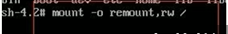
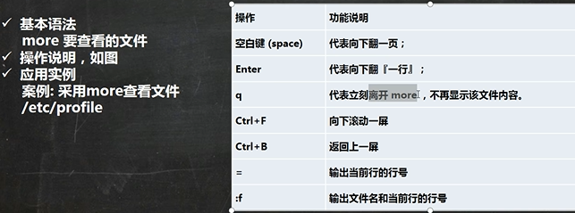
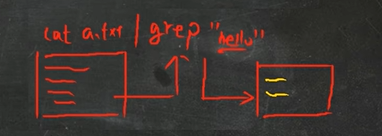

# Liunx

## 1.网络连接三种方式

1.桥接模式，虚拟系统可以和外部系统通讯，但是容易造成IP冲突

2.NAT模式，网络地址转换模式。虚拟系统可以和外部系统通讯，不造成IP冲突

3.主机模式:独立的系统 （不与外界网络连接，想怎么配，怎么配）

## 2.虚拟机克隆

> 迁移虚拟机

方式一：直接找到你安装的虚拟机，复制这个目录到新的环境，再通过vm打开即可（easy）

方式二：vm克隆，需要先关闭Linux系统。（右击你克隆的虚拟机---》管理---->克隆，根据步骤完成（采用完全克隆的方式，不采用引用的方式））

## 3.虚拟机快照

> 将系统回到初始状态或你保存的状态

右击你的虚拟机---》快照---》拍摄快照（快照管理可以查看你每次的快照）

## 4.虚拟机的迁移

> 迁移和克隆是一样的（找对安装目录即可）

## 5.vmtools的安装

**在linux中安装**

> 安装vmtools的步骤
>
> 1.进入centos点击vm菜单的->install vmware toolscentos
>
> 2.会出现一个vm的安装包，xx.tar.gz
>
> 3.拷贝到 /opt
>
> 4.使用解压命令 tar, 得到一个安装文件
>
> 5.进入该vm解压的目录，/opt 目录下
>
> 6.安装./vmware-install.pl
>
> 7.全部使用默认设置即可，就可以安装成功
>
> 注意:安装vmtools需要有gcc.

**在vm中设置**

> 基本介绍
>
> ​	为了方便，可以设置一个共享文件夹，比如d:/myshare
>
> 具体步骤
> 	1.工菜单->vm->setting,如图设置即可注意:设置选项为always enable这样可以读写了
>
> ​	2.windows和centos可共享 d:/myshare目录可以读写文件了
>
> ​	3.共享文件夹在centos的/mnt/hgfs/下
>
> **注意事项和细节说明**
>
> ​	windows 和 contos 就可以共享文件了，但是在实际开发中，文件的上传下载是需要使用 远程方式完成的
>
> 远程方式登录，借助第三方工具xfrp等

## 6.**Linux目录结构

/bin

/sbin

/home

/root

/lib

/lost/found

/etc

/usr

/boot

/proc   **不能动**

/srv  **不能动**

/sys  **不能动**

/tmp

/dev

/media

/mnt

/opt

/usr/local

/var

/selinux

## 7.Linux远程登录和文件传输

使用xshell xftp

## 8.vi vim的使用

## 9.linux关机重启

- shutdown -h now  立刻关机
- shutdown -h 1  1分钟后关机  和shutdown一样
- shutdown -r now  现在重新启动计算机
- halt  关机，作用和shutdown -h now  立刻关一样
- reboot  现在重新启动计算机
- sync **把内存的数据同步到磁盘**

**注意细节**

- ​	不管是重启系统还是关闭系统，首先要运行svnc命令，把内存中的数据写到磁盘中
- ​	目前的 shutdown/reboot/halt 等命令均已经在关机前进行了 sync ，老韩提醒: 小心驶得万年船

## 10.登录注销

> logout：注销---->在运行级别3中有效，也就是无界面

> su - root 切换到root下  ，logout则回到登录用户，再logout则退出

## 11.用户管理

### 用户

1.添加用户

> useradd  用户名      解释：添加用户
>
> useradd -d 目录  用户名   例如：useradd -d /home/test king  表示test为king用户管理的目录
>
> useradd -g 用户组 用户名   解释：增加用户时直接加上组

2.修改用户密码或设置密码

> passwd 用户名  给这个用户名设置密码或修改密码

3.删除用户

>userdel 用户名
>
>应用案例：
>
>1.删除用户，保留用户目录 -----》userdel 用户名
>
>2.删除用户和用户目录------》userdel -r 用户名 **慎重**

4.查询用户

> id 用户名

5.切换用户

> su - 用户名
>
> 注：权限高的向权限低的，不需要密码
>
> ​		回到原来用户-》》logout或exit

6.查看当前第一次登录的用户（su - 换用户后  查看的还是第一登录的用户）

> whoami  或  who am i

### 用户组

1.新增用户组

> groupadd 组名

2.删除组

> groupdel 组名

3.增加用户时直接加上组

> useradd -g 用户组 用户名

4.修改用户的组

> usermod -g 用户组 用户名
>
> usermod -d 目录名 用户名  改变改用户登录的初始目录 。 **注意：**用户需要有进入到新目录的权限

### 用户和组相关文件

/etc/passwd 文件

- 用户(user)的配置文件，记录用户的各种信息
- 每行的含义:用户名:口令(一般这里是x ，加密):用户标识号:组标识号:注释性描述:主目录:登录Shell

/etc/shadow 文件

- 口令的配置文件

- 每行的含义:登录名:加密口令(密码：加密的，！是没有密码):最后一次修改时间:最小时间间隔:最大时间间隔:警告时间:不活动时间:失效时间:标志

/etc/group 文件

- 组(group)的配置文件，记录Linux包含的组的信息
- 每行含义:组名:口令:组标识号:组内用户列表

## 12.指定运行级别

> 基本介绍运行级别说明:
> 0:关机
>
> 1:单用户 (找回丢失密码)
>
> 2:多用户状态没有网络服务  (无意义)
>
> 3.多用户状态有网络服务
>
> 4:系统未使用保留给用户 （现在无意义）
>
> 5:图形界面
>
> 6:系统重启
>
> 注意：常用运行级别是3和5，也可以指定默认运行级别（可以设置），后面演示
>
> **应用实例**
>
> 命令:init [0123456]
>
> ​    应用案例:通过init 来切换不同的运行级别，比如动 5-3 ，然后关机

### 指定默认运行级别

> 在centos7以前，/etc/inittab文件中修改
>
> centos7以后，进行了简化，如下命令
>
> - multi-user.target:类似于运行级别3
> - graphical.target:类似于运行级别5

1.查看当前默认运行级别

> systemctl get-default

2.修改默认运行级别

systemctl set-default graphical.target

## 13.找回root密码

> 注意：（不同版本，不太一样，这里是centos7.6以后   这次演示的是7.6）

1.首先，启动系统，进入开机界面，在界面中按“e”进入编辑界面，如图

2.进入编辑界面，使用键盘上的上下键把光标往下移动，找到以““Linux16”开头内容所在的行数”,在行的最后面输入:init=/bin/sh。
如图

3.接者，输入完成后，直接按快捷键:Ctrl+x 进入单用户模式，
4.接着，在光标闪烁的位置中输入:`mount -o remount,rw / ` (注意:各个单词间有空格)，完成后按键盘的回车键(Entcr)。如图

5.在新的一行最后面输入:passwd， 完成后按键盘的回车键(Ener)。输入密码，然后再次确认密码即可(提示:密码长度最好8位以上,但不是必须的)，密码修改成功后，会显示passwd…的样式，说明密码修改成功

7.接着，在鼠标闪烁的位置中(最后一行中)输入:`touch /.autorelabel`(注意:touch与/后面有一个空格)，完成后按键盘的回车键(Enter)

8.继续在光标闪烁的位置中，输入:`exec /sbin/init`(注意:exec与/后面有一个空格)，完成后按键盘的回车键(Enter)，等待系统自动修改密码( 提示:这个过程时间可能有点长，耐心等待)，完成后，系统会自动重启，新的密码生效了

【可选】最后进入后，可再根据`passwd root `改你想改的密码

## 14.帮助命令

man 获得帮助信息

- 基本语法:man 命令或配置文件(功能描述:获得帮助信息)
- 案例:查看Is命令的帮助信息  `man ls`  (空格翻页)

help指令

- 基本语法:help 命令(功能描述:获得shell内置命令的帮助信息)

应用实例

- 案例:查看cd命令的帮助信息  `help cd`

百度帮助更直接
如果英语不太好的，也可以直接百度靠谱

## 15.文件目录类

> pwd：显示绝对路径

> ls
>
> ​	-l :列表显示
>
> ​	-a ：全部显示
>
> ​	-h:   展示信息更容易理解

> cd
>
> ​	~ :回到用户目录
>
> ​	.. :回到上级目录

> mkdir
>
> ​	-p：创建多级目录

>rmdir :只能删除空目录
>
>rm -rf   ：递归强制删除，危险

> touch  :创建文件，会修改文件时间

> cp   :拷贝指令
>
> ​	cp [选项] 源 目标
>
> ​		-r :递归拷贝
>
> ​		\cp :强制覆盖代替cp命令

> rm  :删除文件
>
> ​	-r  递归删除目录
>
> ​	-f  不提示强制删除

> mv 重命名和移动文件
>
> ​	mv 源文件  目标

> cat  ：查看文件内容
>
> ​	-n :显示行号
>
> ​	经常用法  cat -n xxx | more   :cat配合管道 查询结果用more交换   回车下行   空格翻页

> more more指令是一个基于V编辑器的文本过滤器，它以全屏幕的方式按页显示文本文件的内容。more
> 指令中内置了若干快捷键(交互的指令)，详见操作说明
>
> 

> less ::查大文件，效率好
>
> less指令用来分屏查看文件内容，它的功能与more指令类似，但是比more指令更加强大，支持各种显示终端。less指令在显示文件内容时，并不是一次将整个文件加载之后才显示，而是根据显示需要加载内容，对于显示大型文件具有较高的效率
>
> 

> echo ：输出内容到控制台
>
> ​	例如：输出环境变量：echo $HOSTNAME

> head :head用于显示文件的开头部分内容，默认情况下head指令显示文件的前10行内容
>
> ​	-n 5  :显示前5行

> tail  :tail用于输出文件中尾部的内容，默认情况下tail指令显示文件的前10行内容。
>
> ​	-n
>
> ​	-f :实时的追踪文档的更新

> 理解：能显示的都能写道文件中
>
> ·>·    输出重定向   例如：echo "hello" >  a.txt  （会覆盖）
>
> ·>>·  追加   例如：echo "hello" >>  a.txt   （追加） 
>
> 

> ln :软链接也称为符号链接，类似于windows里的快捷方式，主要存放了链接其他文件的路径
>
> 语法：ln -s 原文件或目录 软链接名    ：给原文件创建一个软链接  类似于win的快捷方式
>
> 应用案例  ln -s /root /home/myroot   
>
> rm /home/myroot   :删除软连接

> history   ：查看历史使用命令
>
> ​	history 10  :表示查看最近使用的10条命令
>
> !编号     ：这个编号是用history查看的那个命令前的编号   意思是把这个命令重新执行一遍，或者直接重新打一遍

## 16.时间日期指令

> date   显示当前日期
>
> 
>
> ​	-s  字符串时间    ：设置系统当前时间  例如：date -s "2024-09-04 14:02:55"

> cal   查看当前月份的日历
>
> cal 2024   :展示2024的1-12的日历

## 17.查找指令

> find    find指令将从指定目录向下递归地遍历其各个子目录，将满足条件的文件或者目录显示在终端。
>
> 语法：find 搜索范围  选项
>
> 
>
> 例如：
>
> ​	find /home -name hello.txt
>
> ​	find /opt  -user nobody   :查找/opt目录下，用户名为nobody的文件
>
> ​	find / -size +200M    查找整个linux大于200M的文件  （+大于 -小于 不写则是等于  ，单位有k,M,G）

> locate  :locate指令可以快速定位文件路径。locate指令利用事先建立的系统中所有文件名称及路径的locate数据库实现快速定位给定的文件。Locate指令无需遍历整个文件系统，查询速度较快。为了保证查询结果的准确度，**管理员必须定期更新locate时刻**
>
> 基本语法
> locate 搜索文件
>  特别说明
> 由于locate指令基于数据库进行查询，所以**第一次运行前，必须使用`updatedb`指令创建locate数据库**,

> which   ：可以查看某个指令在那个目录下  例如ls  which ls

> grep 和管道符号  |
>
> ​	grep 过滤查找     语法：grep  选项  查找内容  源文件  
>
> ​		-n  显示行号
>
> ​		-i  忽略大小写
>
> ​	管道符 |  表示将前一个命令的处理结果输出传递给后面的命令处理
>
> 解释图：
>
> 
>
> cat  a.txt | grep  -n "yes"
>
> grep -n "yes"  a.text

## 18.压缩和解压

> gzip/gunzip   :压缩文件
>
> 

> zip/unzip   :zip 用于压缩文件/文件夹，unzip 用于解压文件/文件夹，这个在项目打包发布中很有用的
>
> 语法：
>
> ​	zip 选项 xxx.zip  压缩的内容
>
> ​		-r 递归压缩，即压缩目录
>
> ​	unzip 选项 xxx.zip  
>
> ​		-d<目录> 指定解压后文件的存放目录
>
> 案例：
>
> ​	zip -r xxx.zip  /home/
>
> ​	unzip -d /opt/ /home/xxx.zip			
>
> 讲解图如下：
>
> ​	 

>tar  打包和解压看选项的选择
>
>语法：
>
>​	tar 选项  xx.tar.gz  打包内容
>
>​	选项
>
>​		-c 产生打包文件
>
>​		-v 显示详细信息
>
>​		-f	指定压缩后的文件
>
>​		-z	打包同时压缩
>
>​		-x	解包.tar文件
>
>
>
>案例：
>
>tar -zxvf   xxx.tar.gz  -C /opt  解压缩到/opt
>
>tar -zcvf	pc.tar.gz  /home/xxx/a.txt  /home/xxx/b.txt   打包

------

## 19.linux组（难点）

> 一个文件/目录有 所有者 所在组 其他组 ；
>
> ​	所有者：某个用户对这个文件的权限，一般是谁创建谁是创建者
>
> ​	所在组：是某个组对这个文件的权限，默认是创建者所在的组
>
> ​	其他组：其余的组对这个文件的权限

### 1.所有者

> 查看文件的所有者
>
> ​	ls -ahl

> 修改文件所有者
>
> chown 用户名 文件名

### 2.所在组

> 修改文件所在组
>
> chgrp 组名 文件名

## 20.rwx权限
