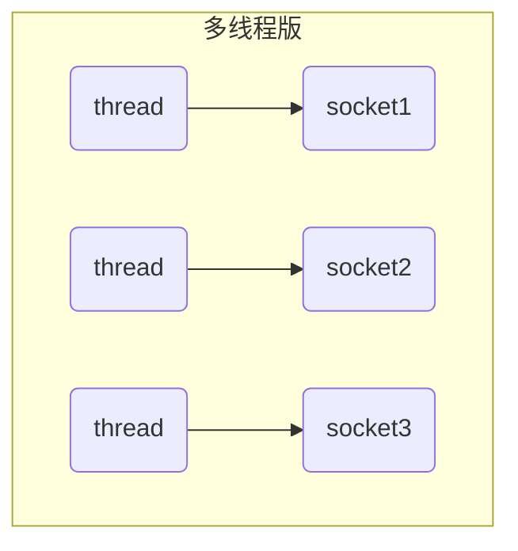
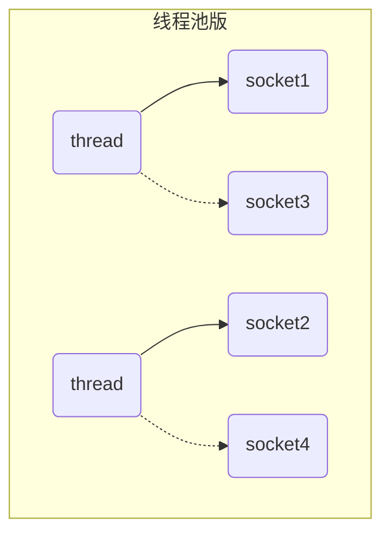
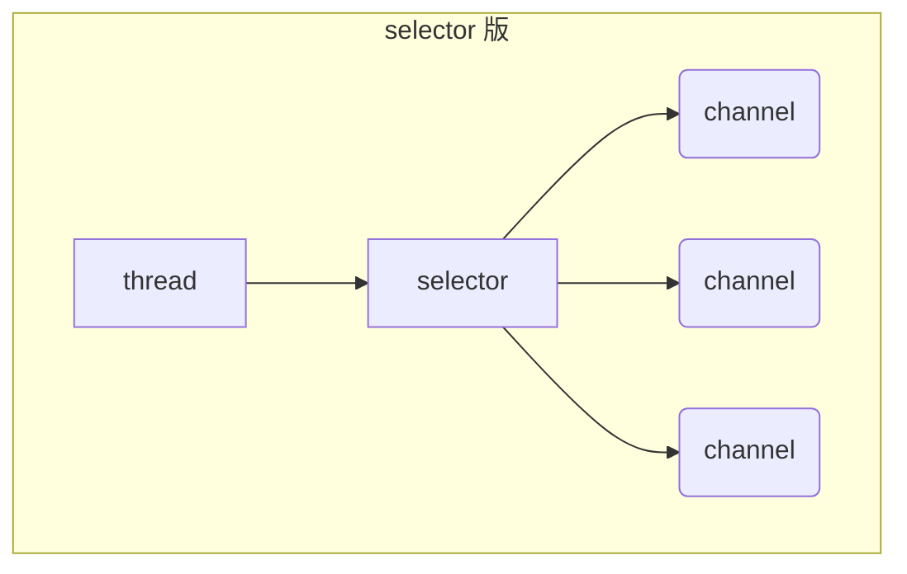

# 网络编程

## NIO基础

### 1.三大组件

#### 1.1channel&Buffer

> channel 有一点类似于 stream，它就是读写数据的双向通道，可以从 channel将数据读入buffer，也可以将buffer的数据写入 channel，而之前的 stream 要么是输入，要么是输出，channel 比 stream 更为底层

1.常见的Channel有

> FileChannel
>
> DatagramChannel
>
> SocketChannel
>
> ServerSocketChannela

2.buffer则用来缓冲读写数据，常见的buffer有

> - ByteBuffer  这个是抽象类，下面是实现类
>   - MappedByteBuffer
>   - DirectByteBuffer
>   - HeapByteBuffer
> - ShortBuffer
> - IntBuffer
> - LongBuffer
> - FloatBuffer
> - DoubleBUffer
> - CharBuffer

#### 1.2Selector

> selector 单从字面意思不好理解，需要结合服务器的设计演化来理解它的用途

##### 多线程版设计

##### ⚠️ 多线程版缺点

* 内存占用高
* 线程上下文切换成本高
* 只适合连接数少的场景

##### 线程池版设计

##### ⚠️ 线程池版缺点

* 阻塞模式下，线程仅能处理一个 socket 连接
* 仅适合短连接场景

##### selector 版设计

selector 的作用就是配合一个线程来管理多个 channel，获取这些 channel 上发生的事件，这些 channel 工作在非阻塞模式下，不会让线程吊死在一个 channel 上。适合连接数特别多，但流量低的场景（low traffic）

调用 selector 的 select() 会阻塞直到 channel 发生了读写就绪事件，这些事件发生，select 方法就会返回这些事件交给 thread 来处理

### 2.ByteBuffer

